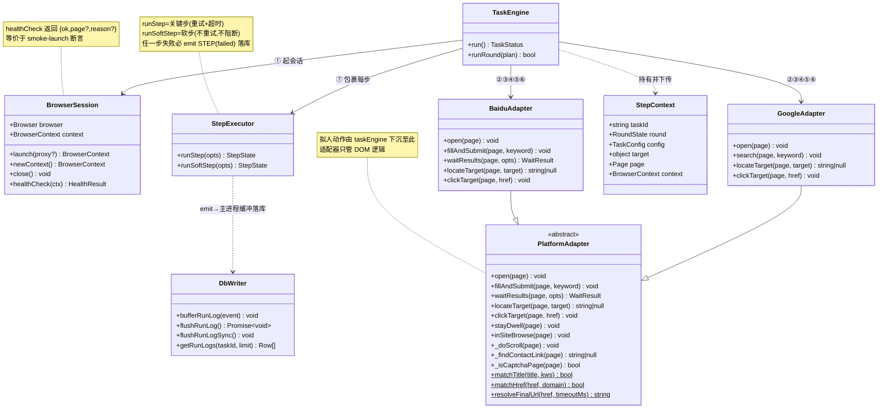
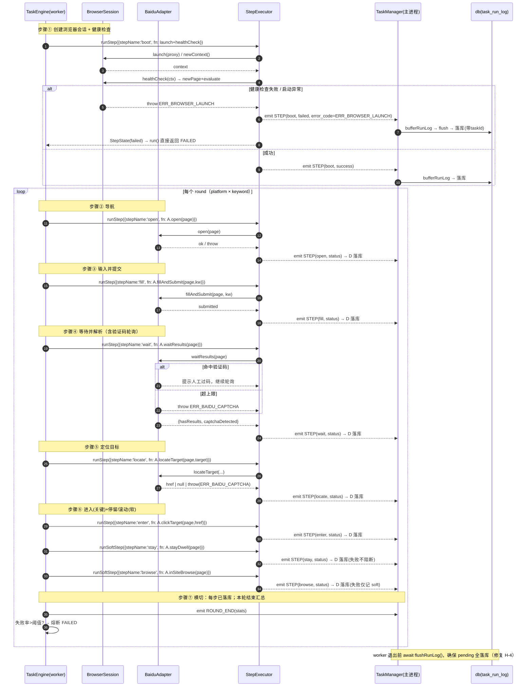

# autoclaw 分步架构设计 + 任务分解（Stepwise Architecture）

> **版本**：stepwise v1 ｜ **作者**：架构师 高见远 ｜ **形态**：系统架构 + 可分步实现/分步测试的任务分解
> **语言**：中文 ｜ **对齐文档**：`docs/prd-autoclaw-stepwise.md`（产品经理分步需求）+ `docs/prd-autoclaw-handoff.md`（整系统交接）
> **事实来源**：已核实 `core/browserSession.js`、`core/adapters/baiduAdapter.js`、`core/taskEngine.js`、`core/taskConfig.js`、`config/defaults.js`、`config/db.js`、`core/taskManager.js`、`core/progressEvent.js`、`package.json`。

---

## 0. 核心结论（先说人话）

把现状「`search()` 一锅炖（ABCD 绑死）+ `runRound` 写死顺序 + 启动失败只 ALERT 不落库」拆成 **7 个可独立开发、可独立测试的步骤模块**，每步配套一个最小验证入口（脚本 / fixture / mock 单测），全部绿了再串。

关键架构决定：

1. **不引入任何新框架**。维持 Node + Playwright（`chromium`，`channel:'chrome'`，`headless:false`）+ Express + socket.io；测试沿用 Node 内置 `node --test`（Node≥18，无需 jest）。分步靠**物理拆方法与新增一个横切执行器**实现，不靠新库。
2. **步骤①（浏览器会话）升格为独立步骤 + 强制 `healthCheck()`**，直接对应 H-1：一个最小脚本 `scripts/smoke-launch.js` 当场暴露「脱离桌面会话起不来 / 弹不出 GUI」的问题。
3. **`baiduAdapter.search()` 物理拆成 `fillAndSubmit()`（③）+ `waitResults()`（④）两个导出方法**，使「提交」与「等待/验证码」可分别用 fixture 注入验证（H-2/H-3）。
4. **步骤⑦横切执行器 `stepExecutor`**：统一封装「重试 + 超时 + 进度事件 + 落库」，且**任一步失败（含启动 `ERR_BROWSER_LAUNCH`）必落 `task_run_log` 并带 `taskId` + `error_code`**——这是修复 H-4 的唯一正确落点。
5. **拟人动作（停留/滚动）从 `taskEngine` 下沉到 `PlatformAdapter` 基类**，使步骤⑥成为内聚、可单独 mock 测试的一组适配器方法。

---

## 1. 实现方案 + 框架选型

### 1.1 技术难点

| 难点 | 对策 |
|------|------|
| 启动失败难定位（H-1：nohup/disown 脱离桌面 → fork 的 worker 弹不出 GUI 静默崩） | 步骤①独立可测 + `healthCheck()`（newPage + evaluate）；失败必落库（见 1.4） |
| 百度验证码（H-2） | 步骤④独立，fixture 注入「正常结果页 / 验证码页」+ `_isCaptchaPage` 纯 mock 单测 |
| 整链耦合、单步不可测（H-3） | 物理拆分 `search()`；每步签名只依赖 `page`/`config`，测试时只构造所需字段 |
| 启动失败被吞、不落库（H-4） | 横切执行器 `stepExecutor` 兜底；并修复「进程退出时内存缓冲未 flush 丢日志」 |
| `actionTimeoutMs` 误调回 30s 会干掉验证码轮询（handoff 坑2） | 架构层固化：`CAPTCHA_WAIT_MS` 恒 ≥ 120000ms，且 `actionTimeoutMs` 默认 150000ms 不可低于 120000ms（共享知识硬性约定） |

### 1.2 框架选型（为何不引入新框架）

- **运行时**：维持 `Node ≥18` + `Playwright`（chromium，`channel:'chrome'`，`headless:false`）。这是「需要本机可见 GUI Chrome」的硬性前提（H-1/坑4），换无头浏览器或换框架都会破坏该前提。
- **Web 层**：维持 `Express` + `socket.io`（进度推送）。步骤模块完全不碰 HTTP/socket，只通过 `emit(progressEvent)` 回调上报，编排仍在 `taskEngine`。
- **持久化**：维持 `mysql2`（默认）/ `better-sqlite3`（可选）双后端，经 `config/db.js` 统一适配层。落库逻辑**不进入 worker**，worker 只 emit 事件，由主进程 `taskManager` 缓冲落库（沿用现架构，保证「worker 崩也不丢已发事件」）。
- **测试**：**不引入 jest/mocha**。Node 内置 `node --test` 已支撑现有 126 个单测；fixture 用 Playwright 的 `page.setContent()` / `page.route()` + 手写 mock page 对象；可选 `sinon`（仅 devDependency，用于 spy `mouse.wheel`/`setTimeout`）。
- **新增的「框架」只有一个文件级概念**：`core/stepExecutor.js`（横切执行器）。它不是第三方库，而是把现有 `taskEngine._runStep/_softStep` 的「重试+超时+落库」抽出来，使步骤①也能享受同一套失败落库逻辑（修复 H-4）。

### 1.3 模块组织（分步后）

```
core/
  browserSession.js        # ① 能力层：launch/newContext/close + 新增 healthCheck()
  stepExecutor.js          # ⑦ 横切执行器（新增）：runStep / runSoftStep，统一重试/超时/落库
  taskEngine.js           # 编排层：①→循环(②~⑥)→⑦，轮次/熔断/暂停安全点
  taskConfig.js           # 配置解析（不变）
  progressEvent.js        # 常量/错误码（扩展 StepName + 新增 ERR_BAIDU_CAPTCHA）
  adapters/
    platformAdapter.js    # 抽象基类：open/fillAndSubmit/waitResults/locateTarget/clickTarget
                          #         + 拟人动作 stayDwell/inSiteBrowse/doScroll/findContactLink（下沉）
    baiduAdapter.js       # 百度实现：拆分 open(②)/fillAndSubmit(③)/waitResults(④)/locateTarget(⑤)/clickTarget(⑥)
    googleAdapter.js      # 谷歌实现（P2：同构拆分，V1 暂不拆）
config/
  defaults.js            # 默认 anthropic/strategy（不变，含 actionTimeoutMs=150000）
  db.js                  # 落库适配层：bufferRunLog/flushRunLog/flushRunLogSync/getRunLogs（扩展 error_code）
scripts/
  worker.js              # worker 入口：运行前 await flush，防启动失败丢日志
  schema.sql / schema.sqlite.sql  # task_run_log 增加 error_code 列
test/
  step1-boot.test.js  step2-open.test.js  step3-fill.test.js  step4-wait.test.js
  step5-locate.test.js  step6-engage.test.js  stepExecutor.test.js
  fixtures/  # baidu-home.html / result-page.html / captcha-page.html / contact-page.html
docs/
  arch-autoclaw-stepwise.md  # 本文档
```

### 1.4 步骤⑦「失败必落库」的根因修复（重点）

**现状为何丢日志**：`taskEngine.run()` 启动失败时只 `this.emit(makeProgress({type:ALERT,...}))` 后 `return FAILED`。虽然主进程 `taskManager._onWorkerMessage` 对每条事件调 `db.bufferRunLog(event)` 压入内存缓冲，但缓冲是「1s 定时器批量落库」；worker 在 `run()` 返回后随即退出，主进程若未及时 flush（或退出路径不同步），`pending[]` 中那条 ALERT 就被丢弃 →「0 日志」（H-4 真因）。

**架构对策**（三层）：
1. **步骤①也走执行器**：`taskEngine` 用 `stepExecutor.runStep({stepName:'boot', ...})` 包裹 `launch()+healthCheck()`，失败时 emit 的是**「STEP 状态=failed 的进度事件」**（而非裸 ALERT），事件结构含 `step='boot'`、`error_code='ERR_BROWSER_LAUNCH'`。
2. **退出前同步 flush**：`scripts/worker.js` 在 worker 进程退出前 `await db.flushRunLog()`（sqlite 提供 `flushRunLogSync` 同步版），确保 `pending` 缓冲全部落库，不为 1s 定时器所困。
3. **`error_code` 列落库**：`task_run_log` 新增 `error_code VARCHAR(64)`，由 `stepExecutor` 从 `err.code` 读取、`db.flattenEvent` 写入；`getRunLogs` 返回对象补 `errorCode` 字段（修复 handoff T-2「回查缺 taskId/错误码」）。

> 注：当前 `config/db.js` 的 `flattenEvent` 已带 `task_id`，`getRunLogs` 也已返回 `taskId`；H-4 的真正缺口是「启动失败事件未以结构化 STEP 行产生 + 退出未 flush」。本方案精准补这两点，并顺手补 `error_code`。

---

## 2. 文件列表及相对路径

> 标注：**【新】**= 新建 ｜ **【改】**= 重构/修改 ｜ 括号内为对应 PRD 步骤。

### 2.1 新建文件
| 文件 | 职责 | 对应步骤 |
|------|------|----------|
| `core/stepExecutor.js`【新】 | 横切执行器 `runStep`/`runSoftStep`：重试 + 超时 + emit 进度事件 + 错误码归一；自身可在内存 db/mock emit 下独立测 | ⑦ |
| `scripts/smoke-launch.js`【新】 | 步骤①最小验证脚本：`launch→newPage→evaluate(1+1===2)→close` | ① |
| `test/step1-boot.test.js`【新】 | `healthCheck` 返回 `{ok:true}`；启动失败抛 `ERR_BROWSER_LAUNCH` | ① |
| `test/step2-open.test.js`【新】 | `open`：url 含 baidu + `#kw` attached（含 hidden fixture）+ 非验证码页 | ② |
| `test/step3-fill.test.js`【新】 | `fillAndSubmit`：提交即返回、不轮询、url 进入结果页 | ③ |
| `test/step4-wait.test.js`【新】 | `waitResults`：正常页快返回 `hasResults:true`；验证码页抛 `ERR_BAIDU_CAPTCHA`；`_isCaptchaPage(mockPage)` 三场景 mock 单测 | ④ |
| `test/step5-locate.test.js`【新】 | `locateTarget`：命中/未命中/跳转链接解析三套 fixture + 验证码页抛错 | ⑤ |
| `test/step6-engage.test.js`【新】 | `clickTarget`/`stayDwell`/`inSiteBrowse`/`_doScroll`/`_findContactLink` mock + fixture 单测（含降级路径） | ⑥ |
| `test/stepExecutor.test.js`【新】 | 注入会抛错 fn，断言落库行 `step_status='failed'`+`error_code`+`taskId`、成功行、熔断阈值 | ⑦ |
| `test/fixtures/baidu-home.html`【新】 | 含 `#kw`（含一个 `visibility:hidden` 变体）的百度首页 fixture | ②③ |
| `test/fixtures/result-page.html`【新】 | 含 `#content_left` + 前 10 条结果（标题含关键词 + 真实/跳转链接） | ④⑤ |
| `test/fixtures/captcha-page.html`【新】 | 含 `#captcha .passMod .tuxing input[name=captcha]`，title「百度安全验证」 | ④ |
| `test/fixtures/contact-page.html`【新】 | 含「联系我们」「/about」链接；及一个「无联系/关于」变体 | ⑥ |

### 2.2 重构文件
| 文件 | 变更要点 | 对应步骤 |
|------|----------|----------|
| `core/browserSession.js`【改】 | 新增 `healthCheck(ctx) → {ok, page?, reason?}`（newPage + evaluate 探针）；`launch`/`newContext`/`close` 不变 | ① |
| `core/adapters/platformAdapter.js`【改】 | 抽象方法增 `fillAndSubmit(page,keyword)`、`waitResults(page,opts)`；**拟人动作 `stayDwell`/`inSiteBrowse`/`_doScroll`/`_findContactLink` 下沉到基类**（平台无关）；删基类里已无用的说明 | ③⑥ |
| `core/adapters/baiduAdapter.js`【改】 | `search()` 物理拆为 `open`(②) + `fillAndSubmit`(③) + `waitResults`(④)；保留 `locateTarget`(⑤)、`clickTarget`(⑥ enter)；`_isCaptchaPage`/`_withStep` 保留 | ②③④⑤⑥ |
| `core/adapters/googleAdapter.js`【改·P2】 | 同构拆分 `fillAndSubmit`/`waitResults`（V1 暂不强制，列此备忘） | ③④ |
| `core/progressEvent.js`【改】 | 扩展 `StepName`：`BOOT='boot'`、`OPEN='open'`、`FILL='fill'`、`WAIT='wait'`（保留 `LOCATE/ENTER/STAY/BROWSE/CLOSE`）；`ERR` 新增 `ERR_BAIDU_CAPTCHA` | 全 |
| `core/taskEngine.js`【改】 | 用 `stepExecutor` 重构：① boot 包裹执行器；②~⑥ 调用拆分后的适配器方法；移除已下沉的 `_stayDwell/_inSiteBrowse/_doScroll/_findContactLink`；失败/熔断逻辑保留 | ①②③④⑤⑥⑦ |
| `config/db.js`【改】 | `flattenEvent` 捕获 `error_code`（取 `step.code`）；新增 `flushRunLogSync()`（sqlite 同步 flush）；`getRunLogs` 返回补 `errorCode` | ⑦ |
| `scripts/worker.js`【改】 | 进程退出前 `await db.flushRunLog()`（或同步 flush），防启动失败丢日志 | ⑦ |
| `scripts/schema.sql`【改】 | `task_run_log` 增加 `error_code VARCHAR(64) NULL` | ⑦ |
| `scripts/schema.sqlite.sql`【改】 | `task_run_log` 增加 `error_code TEXT NULL` | ⑦ |

---

## 3. 数据结构和接口（类图 + 步骤契约表）

### 3.1 类图（Mermaid classDiagram）



### 3.2 每步接口契约表（与 PRD §3 对齐）

| 步骤 | 模块/方法 | 输入 | 输出 | 抛出错误码 | 关键约束 |
|------|-----------|------|------|-----------|----------|
| ① 创建会话 | `BrowserSession.launch(proxy?)` + `healthCheck(ctx)` | env:`AUTOCLAW_CHROME_USER_DATA`/`AUTOCLAW_CHROME_PATH`；可选 `proxy.httpProxy` | `context`（持久化上下文，含 UA/视口）；`healthCheck→{ok:true,page}` | `ERR_BROWSER_LAUNCH` | `headless:false`；`healthCheck`=newPage+evaluate 探针通过才算成功 |
| ② 导航 | `adapter.open(page)` | `page`（来自① newPage）；`BAIDU_HOME`；`#kw` | page 到首页，`#kw` `attached`（含 hidden），非验证码页 | `ERR_ADAPTER_FAIL`（「打开百度首页失败」） | 3 次重试 + 3s 退避；内置 `waitUntil:'domcontentloaded'` |
| ③ 提交 | `adapter.fillAndSubmit(page, keyword)` | `page`、`keyword` | 已写值 + 表单已提交（page 开始/已进结果页） | `ERR_TIMEOUT`/`ERR_ADAPTER_FAIL`（「填写/提交搜索词超时」） | 用 `page.evaluate` 写值+`requestSubmit`，绕开可见性；**不轮询**，远 < 120s 返回 |
| ④ 等待 | `adapter.waitResults(page, {capMs=120000, poll=2000})` | `page`（已提交）；轮询上限/间隔 | `{hasResults:boolean, captchaDetected:boolean}` | `ERR_BAIDU_CAPTCHA`（超上限） | 轮询 `#content_left`；命中验证码→提示人工过码继续；`capMs ≥ 120000` |
| ⑤ 定位 | `adapter.locateTarget(page, target)` | `page`（结果页）、`target={domain,titleKeywords}` | 真实落地 `href` 或 `null` | `ERR_BAIDU_CAPTCHA`（落在验证码页） | 前 10 条双匹配；`href` 经 `resolveFinalUrl`(3s) 解析后再 `matchHref` |
| ⑥ 进入/停留/滚动 | `adapter.clickTarget(page, href)`（关键）+ `adapter.stayDwell(page)`（软）+ `adapter.inSiteBrowse(page)`（软） | `page`、`href`、`config.anthropic` | 已进入目标站 + 停留完成 + 滚动完成 | `ERR_ADAPTER_FAIL`（enter 失败）；软步失败仅记 `soft` 错 | stay=`staySeconds*±20%`；browse=上/下滑随机幅度+间隔；无联系/关于页降级当前页滚动 |
| ⑦ 记录报告 | `stepExecutor.runStep/runSoftStep(opts)` | `opts={taskId,round,stepName,fn,timeoutMs,maxRetry,emit}` | `StepState{step,status,detail,code?,timestamp}`；落库行 + 进度事件 | 透传业务 `err.code` | **任一步失败（含 boot）必 emit STEP(failed)→落 `task_run_log` 带 `taskId`+`error_code`** |

---

## 4. 程序调用流程（时序图 Mermaid）

> 主线：①→（循环 ②→③→④→⑤→⑥）→⑦。失败路由：任一步（含①）失败 → `stepExecutor` emit `STEP(failed)` → 主进程 `taskManager` 缓冲 → `db.flush` → `task_run_log`；关键步失败判本轮失败并跳过，软步失败仅记录；整任务失败率超阈值 → 熔断。



---

## 5. 任务列表（核心：有序、含依赖、按实现顺序）

> **验收闸口（与 PRD §5 一致）**：任何一步若没有对应「独立验证脚本/单测通过」，就不进入下一步实现。下表每个任务都标注了**完成后的独立验证方式**（不依赖整套服务/DB/worker/socket）。
> 任务分两栏：上半为**里程碑（实现阶段，≤5 便于宏观排期）**，下半为**按步骤拆的解任务（实现顺序，含验证）**——解任务才是编码单位。

### 5.1 里程碑（Phase）
| Phase | 范围 | 含解任务 |
|-------|------|----------|
| P1 地基 | 错误码/表结构对齐 + 步骤① | T0, T1 |
| P2 横切 | 步骤⑦执行器 + 落地修复 H-4 | T2 |
| P3 各步 | 步骤②③④⑤⑥ 拆分与单测 | T3, T4, T5, T6 |
| P4 串联 | taskEngine 编排 + 全量回归 + 真机冒烟 | T7 |

### 5.2 解任务（实现顺序 + 依赖 + 独立验证）

| ID | 任务名 | 对应 PRD 步骤 | 涉及文件 | 依赖 | 优先级 | 完成后的独立验证方式 |
|----|--------|--------------|----------|------|--------|----------------------|
| **T0** | 错误码/表结构对齐（前置） | 全 | `core/progressEvent.js`【改】、`config/db.js`【改】、`scripts/schema.sql`【改】、`scripts/schema.sqlite.sql`【改】 | 无 | P0 | 跑 `node --test test/*.test.js` 仍全绿（126/126）；断言 `ERR.ERR_BAIDU_CAPTCHA` 存在、`StepName.BOOT/OPEN/FILL/WAIT` 已定义；`flattenEvent` 能从 `step.code` 取 `error_code` |
| **T1** | 步骤① 浏览器会话 + 健康检查 | ① | `core/browserSession.js`【改·+healthCheck】、`scripts/smoke-launch.js`【新】、`test/step1-boot.test.js`【新】 | T0 | P0 | `node scripts/smoke-launch.js`：断言 `launch→newPage→evaluate(1+1===2)===true→close` 全过；`node --test test/step1-boot.test.js`：断言 `healthCheck` 返回 `ok:true`，且启动失败抛 `ERR_BROWSER_LAUNCH`；**在 nohup/disown 会话下跑应立刻暴露失败** |
| **T2** | 步骤⑦ 横切执行器骨架（落库+补 taskId+启动失败兜底） | ⑦ | `core/stepExecutor.js`【新】、`scripts/worker.js`【改·退出前 flush】、`test/stepExecutor.test.js`【新】 | T0 | P0 | `node --test test/stepExecutor.test.js`：注入 `fn=()=>{const e=new Error('x');e.code=ERR.ERR_BROWSER_LAUNCH;throw e}` → 断言 `emit` 收到 `STEP(failed)` 且 `error_code='ERR_BROWSER_LAUNCH'`、且 `bufferRunLog` 被调用；成功路径断言落 `success` 行；模拟连续失败断言失败率 > 阈值触发熔断告警 |
| **T3** | 步骤② 导航 + 步骤③ 提交（adapter 拆分上） | ②③ | `core/adapters/baiduAdapter.js`【改·拆 fillAndSubmit】、`core/adapters/platformAdapter.js`【改·抽象 fillAndSubmit】、`test/step2-open.test.js`【新】、`test/step3-fill.test.js`【新】、`test/fixtures/baidu-home.html`【新】 | T0 | P0 | `node --test test/step2-open.test.js`：fixture 保证 `#kw` 存在（含 hidden 变体）→ 断言 `page.url()` 含 `baidu`、`$('#kw')` 非 null、`_isCaptchaPage` 为 false；`node --test test/step3-fill.test.js`：调 `fillAndSubmit` 断言提交即返回（url 进结果页）、**测试时长远 < 120s**（证明不轮询） |
| **T4** | 步骤④ 等待/验证码（split 下 + mock 单测） | ④ | `core/adapters/baiduAdapter.js`【改·拆 waitResults】、`test/step4-wait.test.js`【新】、`test/fixtures/result-page.html`【新】、`test/fixtures/captcha-page.html`【新】 | T3 | P0 | 三条独立验证（均不依赖真实浏览器）：(a) `setContent` 注入结果页 fixture → `waitResults` 返回 `hasResults:true` 且很快返回；(b) 注入验证码页 fixture → 断言 `captchaDetected:true` 且超上限抛 `ERR_BAIDU_CAPTCHA`（测试用注入的小 `capMs`）；(c) **纯 mock 单测** `adapter._isCaptchaPage(mockPage)`：分别令 url/title/dom 命中 → 返回 true；正常页 → false |
| **T5** | 步骤⑤ 定位目标（双匹配 + 跳转解析） | ⑤ | `core/adapters/baiduAdapter.js`【改·locateTarget 保留】、`test/step5-locate.test.js`【新】、`test/fixtures/result-page.html`（复用/扩展） | T4 | P0 | `node --test test/step5-locate.test.js`：命中 fixture → 返回真实 URL；未命中 → null；跳转链接（`baidu.com/link?url=`）经 `resolveFinalUrl` 解析后做 `matchHref`；落验证码页 → 抛 `ERR_BAIDU_CAPTCHA`；断言只取前 10 条 |
| **T6** | 步骤⑥ 进入/停留/滚动（拟人动作下沉） | ⑥ | `core/adapters/platformAdapter.js`【改·下沉 stayDwell/inSiteBrowse/_doScroll/_findContactLink】、`core/adapters/baiduAdapter.js`【改】、`core/taskEngine.js`【改·移除这些方法】、`test/step6-engage.test.js`【新】、`test/fixtures/contact-page.html`【新】 | T0 | P0 | 四组独立验证（多用 mock page）：enter → `page.url()===href`；stay → 停留时长 ∈ `[staySeconds*0.8, staySeconds*1.2]`；browse → spy `mouse.wheel` 调用 `scrollUp+scrollDown` 次、幅度 ∈ `[ampMin,ampMax]`、间隔 ∈ `[intervalMin,intervalMax]`；`_findContactLink` → 命中返回完整 URL，无链接返回 null 且触发 soft 错误（降级当前页滚动） |
| **T7** | 串联：taskEngine 编排 ①→循环②~⑥→⑦ + 全量回归 + 真机冒烟 | ①②③④⑤⑥⑦ | `core/taskEngine.js`【改·全面用 stepExecutor+拆分方法】、`core/adapters/baiduAdapter.js`【改·可选保留 `search()` 薄包装兼容】、`scripts/worker.js`【改】 | T1–T6 | P0 | (1) `node --test test/*.test.js`：现有 126 + 新增全绿；(2) 真机（交互桌面会话双击 `start-win.bat`）提交一个百度任务，观察可见 Chrome 窗口逐步执行，且 `task_run_log` 出现 `boot/open/fill/wait/locate/enter/stay/browse` 各一行（含 `error_code`）；(3) **模拟启动失败**（坏 profile/无桌面）→ 断言 `task_run_log` 出现一条 `step='boot', step_status='failed', error_code='ERR_BROWSER_LAUNCH', task_id` 行（H-4 修复验证） |

---

## 6. 依赖包列表

### 6.1 现有依赖（维持，不增删）
| 包 | 版本 | 用途 |
|----|------|------|
| `express` | ^4.19.2 | Web 层（路由/中间件/鉴权） |
| `socket.io` | ^4.7.5 | 进度事件实时推送 |
| `playwright` | ^1.44.0 | 浏览器自动化（`chromium`, `channel:'chrome'`, `headless:false`） |
| `mysql2` | ^3.11.0 | 默认持久化后端（连接池） |
| `better-sqlite3` | ^11.0.0 | 可选持久化后端（`AUTOCLAW_DB_TYPE=sqlite`） |

### 6.2 新增/建议
| 包 | 类型 | 用途 | 是否必须 |
|----|------|------|----------|
| `sinon` | devDependency（^18） | 测试中 spy/mock `mouse.wheel`/`setTimeout`/`page` 方法（步骤⑥） | **可选**——可用手写 mock page 替代，以「零新依赖」为优先 |
| Node 内置 `node --test` | 运行自带（Node≥18） | 单测运行器，替代 jest | 必须（已具备） |
| Playwright `page.setContent()` / `page.route()` | 运行自带 | fixture 注入与网络拦截（步骤②④⑤） | 必须（已具备） |

> 结论：**运行时不引入任何新依赖**；测试侧默认零新增，仅当手写 mock 成本过高时引入 `sinon`（纯 dev 依赖，不影响生产包体）。

---

## 7. 共享知识（跨文件约定）

### 7.1 错误码体系（统一 `core/progressEvent.js::ERR`）
| 错误码 | 语义 | 产生位置 |
|--------|------|----------|
| `ERR_INVALID_CONFIG` | 配置非法（缺平台/关键词/目标站） | `taskConfig` |
| `ERR_BROWSER_LAUNCH` | 浏览器启动/健康检查失败 | `browserSession` / `stepExecutor`(boot) |
| `ERR_BAIDU_CAPTCHA` | 百度验证码未过/结果未加载（超 120s） | `baiduAdapter.waitResults` / `locateTarget` |
| `ERR_NO_TARGET` | 结果前 10 条未命中目标站点 | `taskEngine`(locate 失败) |
| `ERR_ADAPTER_FAIL` | 适配器 DOM 交互失败（open/enter 等） | `baiduAdapter` / `taskEngine` |
| `ERR_TIMEOUT` | 单动作外层超时（含「填写/提交搜索词超时」等明确中文） | `stepExecutor` |
| `ERR_RETRY_EXHAUSTED` | 重试耗尽 | `stepExecutor` |
| `ERR_TASK_RUNNING` / `ERR_TASK_NOT_FOUND` / `ERR_DB_WRITE` / `ERR_DB_QUERY` | 任务态/DB 类 | `taskManager` / `db` |

**硬性约定**：
1. 步骤内抛出的错误**必须携带 `.code`**（`err.code = ERR.XXX`）；`stepExecutor` 从 `err.code` 读取并写入 `error_code` 列 + `detail`。
2. **绝不靠把错误码塞进 message 字符串来传递**（现状 `baiduAdapter` 把 `ERR_BAIDU_CAPTCHA` 写在字符串里、无 `.code`，属反模式，T0/T4 修正）。

### 7.2 健康检查契约（步骤①）
- `healthCheck(ctx)` 返回结构：`{ ok: boolean, page?: Page, reason?: string }`。
- 「步骤①可独立测」等价于「`healthCheck` 稳定返回 `ok:true`」，判定标准 = `newPage()` 成功 **且** `page.evaluate(() => true)` 可返回。
- `headless:false` 是硬前提（见 7.4）。

### 7.3 Profile 目录约定
- **临时 profile**（默认）：`os.tmpdir()/autoclaw-chrome-*`；`close()` 已用 `browser.close()` + `taskkill /PID /F /T` 强杀进程树释放 `ProcessSingleton` 锁，并删除临时目录。
- **持久化 profile**：`AUTOCLAW_CHROME_USER_DATA` 指定；保留登录态降验证码；**多任务并行会撞锁 → 必须单任务串行**（复用 `taskManager` 单活跃守卫，见 §8 Q7）。
- 指定路径：`AUTOCLAW_CHROME_PATH` 覆盖本机 Chrome 可执行文件。

### 7.4 超时与 token 硬性约定
- `actionTimeoutMs` 默认 **150000ms**，**绝不可调回 30000**（否则 `stepExecutor` 会在验证码轮询跑起来前就干掉整步，表象「动作超时」实则到不了验证码逻辑）。
- `CAPTCHA_WAIT_MS`（步骤④轮询上限）恒 **≥ 120000ms**、轮询间隔 2000ms。
- **token 鉴权**：`submit/pause/stop` 的 token 校验在边界中间件（`app.js`）+ socket.io 握手（`io.use`）完成；**步骤模块绝不处理鉴权**，只通过 `StepContext.taskId` 关联，落库行以 `task_id` 为回查主键。

---

## 8. 待明确事项（与 PRD §6 的 7 条呼应 + 架构取舍建议）

| # | PRD §6 待确认 | 架构层取舍建议 |
|---|---------------|----------------|
| 1 | 步骤间状态如何传递？ | **混合方案**：适配器方法签名保持 `(page, ...)`（仅依赖 page，便于单步测试只构造 page）；轮次/任务级状态（`taskId`/`round`/`config`/`target`）由 `TaskEngine` 收进一个 `StepContext` 下传给 `stepExecutor`，适配器不感知。既不破坏现有测试习惯，又显式传递上下文。 |
| 2 | 是否每步都允许人工过验证码？ | **仅步骤④**（`waitResults`）采用「轮询 + 可见窗口提示人工过码」模型；步骤②（open）、步骤⑥（enter）若 `_isCaptchaPage` 命中，按**失败 + 重试**（不无限等人），避免串行循环卡死。理由：只有「等待结果」天然需要等人，其余环节等人会阻断整任务。 |
| 3 | `search` 拆分粒度？ | **物理拆成 `fillAndSubmit`(③) + `waitResults`(④) 两个导出方法**（P0-6 采纳）。可选保留 `search()` 薄包装 = `fillAndSubmit`+`waitResults` 顺序调用，供回归兼容，但新代码走拆分方法。 |
| 4 | 步骤⑦落库形态？ | **复用现有 `task_run_log`**，仅增 `error_code` 列；拆分后每一步（boot/open/fill/wait/locate/enter/stay/browse/close）已是「原子步一行」，ABCD 子步骤已被 open/fill/wait 吸收，**无需再建子步表**（V1）。 |
| 5 | `headless` 未来是否启用？ | `AUTOCLAW_HEADLESS` 预留；`healthCheck` 契约**不假设 GUI 可见**，仅要求 `evaluate` 可返回。若未来启用无头，`browserSession.launch` 据 env 切 `headless` 即可，健康检查逻辑不变。 |
| 6 | 编排归属？ | **步骤模块 = 纯 DOM 逻辑薄适配器 + `stepExecutor` 负责重试/超时/落库**；平台×关键词展开、熔断、暂停/停止安全点**全部留在 `taskEngine`**。适配器不持有轮次状态。 |
| 7 | 持久化 profile 并发守卫？ | **复用 `taskManager` 单活跃任务守卫（A2）**：任意时刻仅一个活跃任务，故 `AUTOCLAW_CHROME_USER_DATA` 锁冲突在架构上不可能发生。若未来允许多 worker，再在 `browserSession` 加 `profile.lock` 文件守卫。 |

---

## 9. 摘要：相对现状需要新建 / 重构的文件

**新建（13 个）**
- 代码：`core/stepExecutor.js`
- 脚本/验证：`scripts/smoke-launch.js`
- 测试：`test/step1-boot.test.js`、`test/step2-open.test.js`、`test/step3-fill.test.js`、`test/step4-wait.test.js`、`test/step5-locate.test.js`、`test/step6-engage.test.js`、`test/stepExecutor.test.js`
- fixture：`test/fixtures/baidu-home.html`、`test/fixtures/result-page.html`、`test/fixtures/captcha-page.html`、`test/fixtures/contact-page.html`

**重构（10 个）**
- `core/browserSession.js`（+healthCheck）
- `core/adapters/platformAdapter.js`（抽象 fillAndSubmit/waitResults + 下沉拟人动作）
- `core/adapters/baiduAdapter.js`（search 物理拆分）
- `core/adapters/googleAdapter.js`（P2 同构拆分，备忘）
- `core/progressEvent.js`（扩 StepName + ERR_BAIDU_CAPTCHA）
- `core/taskEngine.js`（全面接入 stepExecutor + 拆分方法）
- `config/db.js`（error_code + flushRunLogSync）
- `scripts/worker.js`（退出前 flush）
- `scripts/schema.sql` / `scripts/schema.sqlite.sql`（`task_run_log` 增 `error_code` 列）

**任务规模**：8 个解任务（T0–T7），分 4 个里程碑（P1–P4）；每步均带「不依赖整套系统」的独立验证方式，全绿再串。
