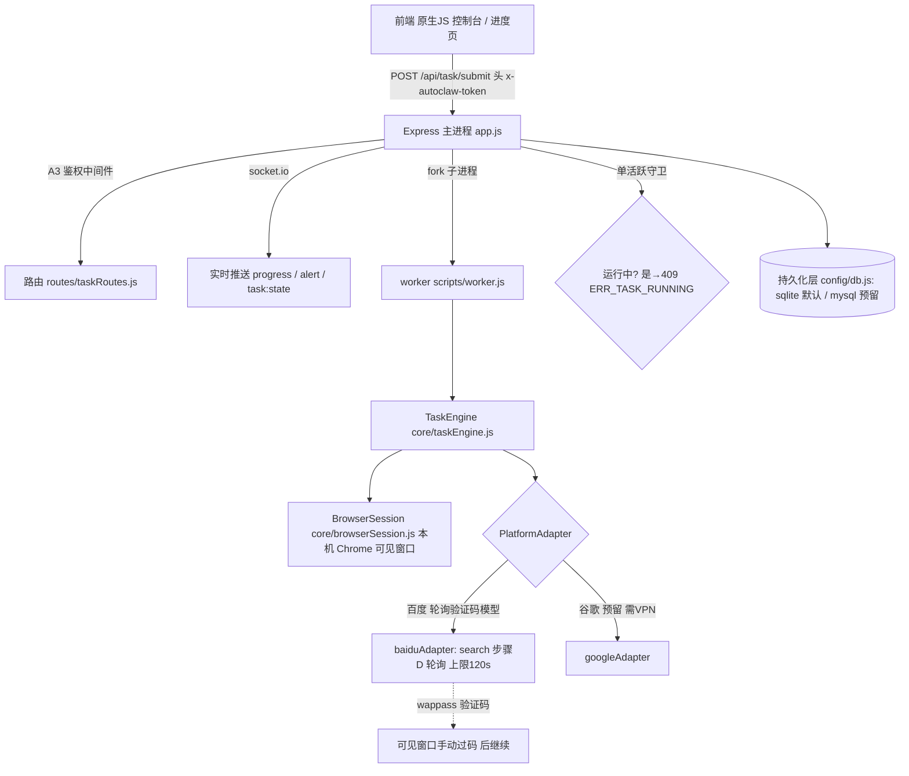

# autoclaw 综合需求 / 技术规格 / 接手文档（Handoff）

> **版本**：handoff v1 ｜ **形态**：综合文档（产品需求 + 技术规格 + 部署运维 + 已实现状态 + 已知坑）
> **语言**：中文 ｜ **读者**：要在**另一台电脑**上接手继续开发的工程师（不熟悉本项目历史）
> **事实来源**：本仓库源码（`config/defaults.js`、`core/adapters/baiduAdapter.js`、`core/browserSession.js`、`README.md`、`package.json`、`.env.example`）＋ 本次修复会话（主理人齐活林确认）的已验证事实。
> ⚠️ 本文档相对既有 `prd-autoclaw-v2.md` / `README.md` 的**更正项**见文末 **§9**。凡与旧文档冲突，以本文档为准。

---

## 1. 文档目的与读者

这份文档不是单纯的产品 PRD，而是一份**「可接手」综合文档**。它的读者是：

- 在**另一台电脑**上拿到这份代码、且**不了解本项目历史**的开发者；
- 需要直接 clone/copy 代码、装环境、把服务跑起来、提交第一个百度任务、并知道哪些坑会让他白干半天的工程师。

因此本文档刻意覆盖 5 个维度（产品需求 / 技术规格 / 部署运维 / 已实现状态 / 已知坑），并**把「过时信息」明确标注更正**，避免接手者被旧 PRD / 旧 README 误导。

> 阅读顺序建议：先看 **§5 部署与运维（致命坑）** 和 **§8 快速上手命令流** 把服务跑通，再看 **§4 技术规格** 理解架构与约定，最后按需回看 **§2/§3 需求** 与 **§6/§7 状态与问题**。

---

## 2. 产品概述

### 2.1 目标

autoclaw 是一款面向 **SEO 推广**的 Windows 原生浏览器自动化工具。运营配置「搜索平台 + 关键词 + 目标站点 + 拟人动作参数」的任务后，工具自动打开搜索页、在结果页定位目标网址、进入目标页停留并拟人化滚动，循环多轮，以提升目标站点在百度 / 谷歌的自然排名曝光。

它由工作室内部运营使用，并直接服务于外部客户的交付——每个任务可归属到具体客户，系统据此生成客户维度的统计与交付报告。当前阶段**专注百度**（谷歌适配器已就位、需 VPN 才能测，先预留），保持轻量、不扩展为通用中台。

### 2.2 用户角色

| 角色 | 类型 | 说明 |
|------|------|------|
| 工作室运营 / 操作人 | 主角色（主动） | 配置并提交任务、实时监控进度、管理客户档案、按客户导出交付报告。是系统唯一操作方。 |
| 客户 | 被动角色 | 不直接操作系统；通过运营导出的交付报告，被动查看自己名下任务的效果（任务数、成功率、命中摘要）。 |

### 2.3 用户故事

**作为运营：**

- 我能勾选平台并填写关键词与目标站点，提交一个拟人化 SEO 任务，并立即看到它开始执行。
- 我能实时看到任务进度（当前轮次 / 步骤 / 成功率），并在需要时暂停或停止。
- 我能从历史配置回填表单，快速复用并重新运行同类任务。
- 我能把任务归属到某客户，并查看该客户下所有任务的数量、成功率与最近运行时间。
- 我能按客户导出 / 查看交付报告（任务执行结果 + 日志摘要），用于给客户做效果交付。

**作为客户（被动）：**

- 我（被动）能收到运营导出的交付报告，了解我名下任务是否命中目标站点、成功率如何。

---

## 3. 需求池（P0 / P1 / P2）

> 取自现有 v2 简单 PRD；保留「客户管理 / 交付报告」等 ★新增项。优先级：P0=必须，P1=应做，P2=可选。

### P0 — 必须（既有核心）

| 编号 | 需求 | 说明 / 关键约定 |
|------|------|----------------|
| P0-1 | 任务配置表单 | 平台多选 百度/谷歌（默认百度；**前端谷歌复选框 + 多平台模式选择器已 `display:none` 隐藏**，本地只跑百度——页面看不到谷歌选项属正常非 bug，代码未禁用，`GoogleAdapter` 仍在，`API` 仍可提交 `platforms:['google']` 测试需本机 VPN）；关键词支持 `\|` `、` `,` 分隔（服务端 `splitTokens`）；`targetDomain` + `titleKeywords` 双匹配定位（必填）；拟人参数 `staySeconds/scrollUp/scrollDown/ampMin/ampMax/intervalMin/intervalMax`；`run_mode` 串行（默认）/ 并发（预留）；令牌 `token`（前端 `localStorage`）。 |
| P0-2 | 任务提交即落库 | `POST /api/task/submit` 先写 `task_config` 落库，再 `taskManager.submit` 启动 worker；单活跃任务守卫：运行中提交返回 `409 ERR_TASK_RUNNING`。 |
| P0-3 | 百度 SEO 执行引擎 | worker 驱动，每轮 `search → locate → enter → stay → browse → close`；`locate` 双匹配取前 10 条首个命中；`stay/browse` 拟人化（带随机抖动）；轮次 = 平台数 × 关键词数，默认串行。 |
| P0-4 | 实时进度回传 | socket.io 推 `progress`（客户端 `task:join` 进 `taskId` 房间）；`alert` 额外推熔断告警；`GET /api/task/progress` 轮询兜底；步状态 `step_status`（success/failed）驱动成功率。 |
| P0-5 | 任务生命周期控制 | 暂停/停止：`POST /api/task/pause\|stop` 或 socket `task:pause\|task:stop`；终态释放活跃槽位，允许重新提交。 |
| P0-6 | 历史与运行日志 | `GET /api/task/history`（created_at DESC，可回填表单）；`GET /api/task/logs?taskId=`（时间线 + 成功率 `{total,success,fail,failRate}`）。 |
| P0-7 | SQLite 持久化 | 默认 `sqlite`，写 `data/autoclaw.db`，首次启动幂等建表；运行记录内存缓冲定时批量落库；MySQL 双后端 `query` 适配层预留。 |

### P0 — 必须（★新增：服务客户线）

| 编号 | 需求 | 说明 |
|------|------|------|
| P0-8 | 客户管理 CRUD | 增删改查：名称 `name` / 联系人 `contact` / 备注 `notes`；数据存新增 `client` 表。 |
| P0-9 | 任务归属客户 | 提交任务时可选 `client_id`，写 `task_config.client_id`；未绑定可为 NULL。 |
| P0-10 | 客户维度统计 | 按 `client_id` 聚合：任务数、整体成功率（基于 `task_run_log.step_status`）、最近运行时间。 |
| P0-11 | 交付报告 | 按客户查看其所有任务执行结果汇总，支持导出（CSV / Markdown / HTML）；当前交付「日志摘要」版（命中截图属 P1 新增采集能力）。 |

### P1 — 应做（后续增强）

- **谷歌平台**：VPN 可用后启用 `googleAdapter`，串行先于百度。
- **任务模板复用**：常用配置存模板，提交一键套用（当前已有历史回填，模板为增强）。
- **批量提交**：一次提交多组关键词 / 多客户任务，批量落库。
- **运行日志可视化时间轴**：进度页把 `task_run_log` 渲染为时间轴（步骤 / 状态 / 耗时 / 错误）。

### P2 — 可选（远期）

- **MySQL 接入**：`AUTOCLAW_DB_TYPE=mysql`，复用双后端 `query` 适配层。
- **操作审计**：记录运营操作（提交 / 暂停 / 停止 / 客户增删）到审计表。
- **定时任务**：按 cron / 周期自动提交任务。

---

## 4. 技术规格

### 4.1 技术栈

| 维度 | 选型 | 备注 |
|------|------|------|
| 运行时 | **Node.js ≥ 18**（推荐 v22） | `package.json` 声明 `engines.node >=18`；本机验证用 v22。 |
| Web 框架 | Express 4（`^4.19.2`） | 主进程 HTTP + 鉴权中间件。 |
| 实时通信 | socket.io 4（`^4.7.5`） | progress / alert / task:state 推送。 |
| 浏览器自动化 | Playwright（`^1.44.0`） | **复用本机已装 Chrome**（`channel:'chrome'`），非 Playwright 自带 Chromium。 |
| 持久化 | SQLite（`better-sqlite3 ^11.0.0`，默认）/ MySQL（`mysql2 ^3.11.0`，预留） | 双后端 `query` 适配层（`config/db.js`）。 |
| 前端 | 纯原生 HTML/CSS/JS，无构建步骤 | `public/index.html`、`progress.html` 等。 |

> ⚠️ **关键事实**：浏览器使用**本机已安装 Chrome**，`headless:false` 弹**真实可见窗口**，每个任务隔离 `userDataDir`。**不需要也不建议** `npx playwright install chromium`（见 §5）。

### 4.2 架构图



### 4.3 目录结构

```
autoclaw/
├── app.js                      # 主进程入口：Express + socket.io + 鉴权
├── package.json
├── start-win.bat              # Windows 原生启动脚本（设环境变量后 node app.js）
├── .env.example               # 环境变量样例（复制为 .env）
├── config/
│   ├── site.config.js          # 默认目标站点 + 表单预填
│   ├── defaults.js             # 拟人参数 / 策略默认值（支持 AUTOCLAW_ 环境变量覆盖）
│   └── db.js                   # 持久化层（双后端 sqlite/mysql）+ 运行日志缓冲
├── core/
│   ├── taskConfig.js           # 配置解析校验 + 关键词拆分 + 轮次计划生成
│   ├── taskManager.js          # 主进程任务管理：fork/暂停/停止/进度/转发
│   ├── taskEngine.js           # worker 内轮次循环 + 容错 + 熔断 + 拟人动作
│   ├── browserSession.js       # Playwright 浏览器/上下文生命周期（本机 Chrome 可见窗口）
│   ├── progressEvent.js        # ProgressEvent 构造 + 事件/状态/错误码常量
│   ├── linkMatcher.js          # 站内目标页锚点匹配纯函数（可配置 browseAnchor 子串匹配）
│   └── adapters/
│       ├── platformAdapter.js  # 抽象基类 + 双匹配/重定向解析工具
│       ├── baiduAdapter.js     # 百度适配器（轮询验证码模型）
│       └── googleAdapter.js    # 谷歌适配器（预留，需 VPN）
├── routes/
│   ├── taskRoutes.js           # /api/task/{submit,progress,pause,stop,status,history,logs}
│   └── clientRoutes.js         # /api/client/{list,create,get,update,delete,stats,report}（V2 客户线）
├── scripts/
│   ├── worker.js               # worker 子进程入口（IPC ↔ TaskEngine）
│   ├── schema.sql              # 建表 DDL（MySQL 后端：task_config / task_run_log / client）
│   ├── schema.sqlite.sql       # 建表 DDL（SQLite 后端；含 client 表 + task_config.client_id）
│   ├── migrate-client-live.js  # 一次性迁移：对已有 data/autoclaw.db 补 client 表 + client_id 列（幂等）
│   └── screenshot.js           # Playwright 示例，保留参考
├── public/
│   ├── index.html              # 任务配置表单页
│   ├── progress.html           # 进度看板页
│   ├── css/style.css
│   └── js/{config.js,progress.js}
├── test/                       # 单元测试（node --test test/*.test.js）= 203 用例 / 202 通过 / 1 skip（skip 为真实浏览器 e2e 用例；新增 clientRoutes/clientData 覆盖客户线 + browseRelativeLink 覆盖相对路径解析）
├── logs/                       # 运行日志目录
└── data/                       # SQLite 库文件 / Chrome 临时 profile（data/autoclaw.db）
```

### 4.4 关键约定表

| 约定项 | 内容 |
|--------|------|
| **API 请求体字段（驼峰！）** | `POST /api/task/submit` 用 `platforms` / `keywords` / `targetDomain` / `titleKeywords` / `staySeconds` / `runMode` 等**驼峰字段**。**注意 `targetDomain` 不是 `target_domain`**（见 §9 更正）。 |
| API 响应信封 | `{ code: 0, data: {}, message: 'ok' }`，非 0 即错误。 |
| socket 事件 | 客户端→服务端：`task:join` / `task:pause` / `task:stop`；服务端→客户端：`progress` / `task:state` / `alert`；房间 = `taskId`。 |
| 双匹配定位 | 结果前 10 条中，标题含任一 `titleKeywords` **且** 真实地址含 `targetDomain`，取首个。 |
| 站内「目标页锚点」 | BROWSE 步骤站内寻找「关于/联系」类页，锚点**可配置**：表单输入框 `browseAnchor`（默认「关于我们」），用户按目标站实际文案填写（如「关于万年」）。匹配逻辑在 `core/linkMatcher.js` 纯函数 `matchContactLink(text, path, anchor)`：`text.includes(anchor) \|\| GENERIC_TEXT_RE.test(text) \|\| PATH_RE.test(path)`，其中 `GENERIC_TEXT_RE=/联系\|contact\|about/i`、`PATH_RE=/\/(contact\|about\|about-us)\b/i`。即用**子串匹配**锚点（替代原硬编码 `TEXT_RE=/联系\|关于\|contact\|about/i`），保留 `/contact\|/about` 路径兜底与「联系」通用兜底。数据流：`public/index.html` 输入框 → `public/js/config.js` 读 `payload.browseAnchor` → `core/taskConfig.js` 解析兜底「关于我们」写入 `target.browseAnchor` → `core/taskEngine.js` `_findContactLink` 用 `this.config.target.browseAnchor` 调 `matchContactLink`。背景：用户目标站导航叫【关于万年】、关于页叫【关于我们】，原硬编码正则匹配不稳导致 BROWSE 软失败；填「关于万年」即可命中。 |
| 拟人停顿（round 间） | `run()` 主循环在每轮之间（除第一 round 外）加 `await sleep(randInt(8000,20000))`（8–20s 随机），拉开连续搜索间隔降低百度风控。 |
| 容错 / 熔断 | 单动作重试 2 次；**单动作超时默认 150000ms（见 §9，原 30000 已废止）**；单轮失败跳过继续；失败率 >30% 熔断（自动暂停 + 告警 + 终态 `failed`/熔断）。 |
| 鉴权 | 请求头 `x-autoclaw-token`（或 `?token=` 参数），对照 `AUTOCLAW_TOKEN`，开发期值 `autoclaw-dev`。 |
| 错误码 | `ERR_INVALID_CONFIG` `ERR_NO_TARGET` `ERR_ADAPTER_FAIL` `ERR_TIMEOUT` `ERR_RETRY_EXHAUSTED` `ERR_BROWSER_LAUNCH` `ERR_TASK_NOT_FOUND` `ERR_TASK_RUNNING` `ERR_DB_WRITE` `ERR_DB_QUERY` `ERR_BAIDU_CAPTCHA`（百度验证码未通过/超时）。 |
| 轮次推导 | 循环轮数 = 平台数 × 关键词数，由引擎 `buildRounds` 自动推导（非独立表单输入）。 |

### 4.5 核心数据模型

> 字段命名与现有代码（`scripts/schema.sql` / `config/db.js`）严格对齐。**★ 为 v2 新增字段/表**。**`action_timeout_ms` 默认值已更正为 150000（原 30000 废止，详见 §9）**。

**task_config（任务配置）**

| 字段 | 类型 | 约束 / 默认 | 说明 |
|------|------|-------------|------|
| `task_id` | TEXT | PK | UUID。 |
| `platforms` | TEXT(JSON) | NOT NULL | 平台数组，如 `["baidu"]`。 |
| `keywords` | TEXT(JSON) | NOT NULL | 关键词数组。 |
| `target_domain` | TEXT | NOT NULL | 目标域名（双匹配之一）。<br>⚠️ DB 列是 `target_domain`（蛇形），API 请求体用 `targetDomain`（驼峰）。 |
| `title_keywords` | TEXT(JSON) | NOT NULL | 标题关键词数组（双匹配之一）。 |
| `stay_seconds` | INTEGER | DEFAULT 15 | 目标页停留秒数。 |
| `scroll_up` / `scroll_down` | INTEGER | DEFAULT 3 | 上滑 / 下滑次数。 |
| `amp_min` / `amp_max` | INTEGER | 300 / 800 | 滚动幅度下限 / 上限(px)。 |
| `interval_min` / `interval_max` | REAL | 1.0 / 2.0 | 动作间隔下限 / 上限(秒)。 |
| `run_mode` | TEXT | DEFAULT 'serial' | 串行 / 并发（并发预留）。 |
| `fail_rate_threshold` | REAL | DEFAULT 0.3 | 熔断失败率阈值。 |
| `max_retry` | INTEGER | DEFAULT 2 | 单步最大重试。 |
| **`action_timeout_ms`** | INTEGER | **DEFAULT 150000** | **单步超时(ms)。原 30000 已废止——百度 search 步骤 D 验证码轮询上限 120s，外层须 ≥120s。可用 `AUTOCLAW_ACTION_TIMEOUT` 覆盖。** |
| `status` | TEXT | DEFAULT 'pending' | pending/running/paused/stopped/completed/failed。 |
| `operator` | TEXT | NULL | 关联 `AUTOCLAW_TOKEN`（仅作标签）。 |
| `proxy_json` | TEXT | NULL | 代理配置（V1 预留未生效）。 |
| `client_id` | TEXT | NULL ★新增 | FK → `client.client_id`，未绑定为 NULL。 |
| `created_at` / `updated_at` | TEXT | NOT NULL / NULL | 创建 / 更新时间（UTC）。 |

**task_run_log（运行记录）**

| 字段 | 类型 | 说明 |
|------|------|------|
| `id` | INTEGER PK AUTOINCREMENT | 自增主键。 |
| `task_id` | TEXT NOT NULL | FK → `task_config.task_id`。 |
| `round` / `total_rounds` | INTEGER NULL | 轮次序号 / 总轮次（= 平台数 × 关键词数）。 |
| `platform` / `keyword` | TEXT NULL | 本轮平台 / 关键词。 |
| `step` | TEXT NULL | search/locate/enter/stay/browse/close。 |
| `step_status` | TEXT NULL | pending/running/success/failed。 |
| `event_type` | TEXT NULL | round_start/step/round_end/task_end/paused/stopped/alert。 |
| `message` / `error` | TEXT NULL | 人类可读描述 / 错误信息。 |
| `timestamp` | TEXT NOT NULL | 事件时间。 |

**client（★ 新增，客户档案）**

| 字段 | 类型 | 说明 |
|------|------|------|
| `client_id` | TEXT PK | UUID。 |
| `name` | TEXT NOT NULL | 客户名称。 |
| `contact` / `notes` | TEXT NULL | 联系人 / 备注。 |
| `created_at` / `updated_at` | TEXT | 创建 / 更新时间。 |

> 建表 DDL（SQLite 风格，与现有 schema 一致）：`CREATE TABLE IF NOT EXISTS client (client_id TEXT NOT NULL, name TEXT NOT NULL, contact TEXT NULL, notes TEXT NULL, created_at TEXT NOT NULL, updated_at TEXT NULL, PRIMARY KEY (client_id));`；`ALTER TABLE task_config ADD COLUMN client_id TEXT NULL;`

### 4.6 API 速览表

| 方法 | 路径 | 鉴权 | 说明 |
|------|------|------|------|
| POST | `/api/task/submit` | 是 | 提交并启动任务，body 用**驼峰** `platforms/keywords/targetDomain/titleKeywords` 等；返回 `{ taskId, status }`；运行中返回 **409 ERR_TASK_RUNNING**。 |
| GET | `/api/task/progress?taskId=` | 是 | 轮询进度快照（降级链路）。 |
| POST | `/api/task/pause` | 是 | 暂停任务，body `{ taskId }`。 |
| POST | `/api/task/stop` | 是 | 停止任务，body `{ taskId }`。 |
| GET | `/api/task/status` | 是 | 活跃任务概览。 |
| GET | `/api/task/history` | 是 | 历史配置列表（created_at DESC）。 |
| GET | `/api/task/logs?taskId=` | 是 | 运行记录时间线 + 成功率 / 失败率。 |
| GET | `/api/status` | **否** | 健康检查（不鉴权）。 |

> ⚠️ `POST /api/task/submit` 的 body 字段是**驼峰**（`targetDomain` / `titleKeywords` / `platforms` / `keywords` / `staySeconds` / `runMode` / `failRateThreshold` / `maxRetry` / `actionTimeoutMs` 等），与 DB 列的蛇形命名不同——这是接手者最易踩的字段名坑（见 §9）。

| 方法 | 路径 | 鉴权 | 说明 |
|------|------|------|------|
| GET | `/api/client/list` | 是 | 列出全部客户（created_at DESC）。 |
| POST | `/api/client/create` | 是 | 新建客户，body `{ name, contact?, notes? }`（name 必填）。 |
| GET | `/api/client/:id` | 是 | 取单个客户；不存在 404 ERR_CLIENT_NOT_FOUND。 |
| PUT | `/api/client/:id` | 是 | 更新客户，body `{ name?, contact?, notes? }`（局部更新）。 |
| DELETE | `/api/client/:id` | 是 | 删除客户；存在关联任务返回 409 ERR_CLIENT_HAS_TASKS。 |
| GET | `/api/client/:id/stats` | 是 | 客户维度统计（任务数 / 整体成功率 / 最近运行时间）。 |
| GET | `/api/client/:id/report` | 是 | 交付报告；`?format=markdown`（默认）/ `csv` / `html`，返回附件。 |

> 任务归属客户：`POST /api/task/submit` 的 body 可附 `clientId`（驼峰；或 `client_id`），引擎落库到 `task_config.client_id`，供上述统计/报告按客户聚合。

---

## 5. 部署与运维（重点章节）

### 5.1 部署形态（实际形态，务必看清）

> **实际部署形态 = Windows 原生 Node 服务**，复用本机已装 Chrome（`channel:'chrome'`、`headless:false` 弹真实可见窗口），每个任务隔离 `userDataDir`。**不再以 WSL 无头部署为主形态**（旧 README 的 WSL/宝塔无头描述已过时，见 §9）。

| 维度 | 实际约定 |
|------|----------|
| 运行环境 | Windows 10/11 桌面会话 + Node ≥ 18 + 本机已装 Chrome（稳定版）。 |
| 服务端口 | 监听 `0.0.0.0:7788`（裸域名经 `netsh portproxy` 80→7788 转发兜底）。 |
| 浏览器 | 本机 Chrome（`channel:'chrome'`），**可见窗口**，隔离 `userDataDir`。 |
| 平台范围 | 本机先只跑**百度**；谷歌需 VPN（适配器已就位，本地不可测）。前端页面已把谷歌复选框 + 多平台模式选择器 `display:none` 隐藏（用户原则「代码不禁用谷歌」，`GoogleAdapter` 仍在，`API` 仍可提交 `platforms:['google']`），页面看不到谷歌选项属正常非 bug。 |
| 持久化 | 默认 **SQLite**（`AUTOCLAW_DB_TYPE=sqlite`，库 `data/autoclaw.db` 启动自动建表）；MySQL 双后端预留（`AUTOCLAW_DB_TYPE=mysql` + 先跑 `scripts/schema.sql`）。 |
| 鉴权 | 简单 token（`x-autoclaw-token`，开发期 `autoclaw-dev`），单账号。 |
| 并发 | 单活跃任务守卫（运行中提交返回 `409 ERR_TASK_RUNNING`）。 |

### 5.2 Windows 原生部署 step-by-step

**前置条件**

1. Windows 10/11，已安装 **Node.js ≥ 18**（推荐 v22）。
2. 已安装本机 **Chrome 稳定版**（程序用 `channel:'chrome'` 自动探测；或设 `AUTOCLAW_CHROME_PATH` 指定）。
3. 已取得代码（git clone 或拷贝目录）。

**步骤**

```bat
REM 1) 装依赖（含 express / socket.io / playwright / mysql2 / better-sqlite3）
npm install

REM 2) 配置环境变量：复制样例
copy .env.example .env
REM    （默认 AUTOCLAW_DB_TYPE=sqlite，开箱即用，无需数据库服务器）

REM 3) 启动服务 —— 务必在【交互桌面会话】中启动（双击 start-win.bat，
REM     或在该桌面会话内“后台任务”方式启动）；绝不用 nohup/disown 脱离会话（见 §5.4-坑1）
双击 start-win.bat
REM    start-win.bat 内容等价于：
REM      set AUTOCLAW_TOKEN=autoclaw-dev
REM      set AUTOCLAW_DB_TYPE=sqlite
REM      node app.js

REM 4) 验证：浏览器打开 http://localhost:7788 看到配置控制台即成功
REM 5) 健康检查（不鉴权）：curl http://localhost:7788/api/status
```

> 如切回 MySQL：设 `AUTOCLAW_DB_TYPE=mysql`，并在 `autoclaw` 库先执行 `scripts/schema.sql`。

### 5.3 环境变量清单

| 变量 | 默认值 | 说明 |
|------|--------|------|
| `AUTOCLAW_TOKEN` | `autoclaw-dev` | 访问令牌（对照请求头 `x-autoclaw-token` / `?token=`）。 |
| `PORT` | `7788` | 监听端口。 |
| `AUTOCLAW_DB_TYPE` | `sqlite` | 持久化后端：`sqlite`=本地免服务器（启动自动建表 `data/autoclaw.db`）；`mysql`=连 WSL/远程 MySQL（需先跑 `scripts/schema.sql`）。 |
| `AUTOCLAW_SQLITE_PATH` | 空（默认 `data/autoclaw.db`） | 仅 `sqlite` 模式生效。 |
| `AUTOCLAW_DB_HOST` / `_PORT` / `_USER` / `_PASSWORD` / `_NAME` / `_LIMIT` | `localhost` / `3306` / `root` / `''` / `autoclaw` / `10` | MySQL 连接配置（切回 mysql 时填）。 |
| `AUTOCLAW_TARGET_DOMAIN` | `manincorp.cn` | 默认目标域名（表单预填）。 |
| `AUTOCLAW_TITLE_KEYWORDS` | `万年移民` | 默认标题关键词（表单预填）。 |
| `AUTOCLAW_STAY_SECONDS` / `_SCROLL_UP` / `_SCROLL_DOWN` / `_AMP_MIN` / `_AMP_MAX` / `_INTERVAL_MIN` / `_INTERVAL_MAX` | `15` / `3` / `3` / `300` / `800` / `1` / `2` | 拟人参数覆盖。 |
| `AUTOCLAW_MODE` / `_FAIL_RATE` / `_MAX_RETRY` | `serial` / `0.3` / `2` | 策略参数覆盖。 |
| **`AUTOCLAW_ACTION_TIMEOUT`** | **`150000`** | **单动作超时(ms)。原文档写的 `30000` 已废止（见 §9）。百度 search 步骤 D 验证码轮询上限 120s，外层须 ≥120s。** |
| `AUTOCLAW_CHROME_PATH` | 空（自动探测） | 可选，指定本机 Chrome 可执行文件路径。 |
| `AUTOCLAW_CHROME_USER_DATA` | 空（每次临时目录） | **可选但强烈建议**：指定持久化 Chrome profile 目录；先手动在该窗口登录一次百度，之后基本不再弹验证码（绕过风控主手段）。单任务串行使用。 |
| `AUTOCLAW_HEADLESS` / `AUTOCLAW_SCREENSHOT` | 预留 | `.env.example` 中预留、当前**未使用**。 |

### 5.4 ⚠️ 致命坑清单（接手者必读，按杀伤力排序）

> 这几个坑都是「按旧文档常规操作会白干半天且查不到原因」的级别，请逐条对照。

**坑 1（最致命）：服务必须挂在「交互桌面会话」中启动，绝不能用 `nohup ... & disown` 脱离会话**

- **现象**：任务 `failed` + **0 行日志** + 控制台**无任何报错**，极难排查。
- **根因**：`worker` 子进程要弹出 GUI 版 Chrome（`headless:false`）。若主进程用 `nohup node app.js > log 2>&1 & disown` 之类脱离桌面会话启动，fork 出的 worker 拿不到桌面会话，弹不出真实 Chrome 窗口 → 静默崩溃。
- **正确做法**：在 Windows 桌面会话里**双击 `start-win.bat`**，或用「任务计划程序 / 后台任务」方式**挂在该交互会话下**启动。`setsid nohup ... & disown` 在 Linux/WSL 那套不要再搬过来。
- ⚠️ 同理，远程桌面(RDP)断开时若会话被注销，可见窗口也会消失；需要保持会话（或配置「断开时不断开会话」）。

**坑 2（高致命）：`actionTimeoutMs` 必须 ≥ 120000ms（默认 150000）；不要调回 30000**

- **原因**：百度 `search` 步骤 D 在提交搜索后会**轮询等待结果 / 验证码，上限 120000ms**。外层超时若 < 120s（如旧值 30000），会在验证码轮询逻辑跑起来之前就把 search 干掉，表面现象就是「动作超时（30000ms）」，本质永远到不了验证码处理。
- **正确值**：保持默认 `150000`；即便想调小也**不要低于 ~130000**。可用 `AUTOCLAW_ACTION_TIMEOUT` 覆盖。
- 子超时设计佐证（`baiduAdapter.js`）：步骤A 等搜索框 10s + 步骤B 填词 6s + 步骤C 提交 6s（最坏 22s）< 外层 150s；步骤D 轮询上限 120s，间隔 2s。

**坑 3（高）：百度风控 / 验证码——adapter 是「轮询模型」而非 fail-fast（`open` 与 `search` 均感知）**

- `baiduAdapter.open()` 进入百度首页后**先查 `_isCaptchaPage`**：若落在验证码页（`wappass.baidu.com`），轮询等待用户在可见 Chrome 窗口手动过码（上限 120s、间隔 2s；常量 `CAPTCHA_WAIT_MS` / `CAPTCHA_POLL_INTERVAL` 为模块级，`open`/`search` 共用）；过码后继续，超时仍被拦则抛清晰的 `ERR_BAIDU_CAPTCHA`（原为 cryptic 的 `#kw 15s Timeout`）。
- `baiduAdapter.search()` 步骤 D 提交后**轮询**等待结果页（`#content_left`）出现，间隔 2s、上限 120s。
- 若被风控重定向到验证码页，**不会立即失败**，而是打印可操作提示并继续轮询，**等待用户在可见窗口手动完成验证**，验证通过后自动继续。
- 仅当 120s 内仍无结果 / 未过码，才抛 `ERR_BAIDU_CAPTCHA`。
- 因此「任务卡在 search / open 步骤很久不动」通常是**正在等你在弹出的 Chrome 窗口里手动过验证码**，不是死循环——去桌面看一眼 Chrome 窗口。

**坑 4：必须有 GUI 桌面（可见窗口）**

- 因为 `headless:false`，运行机器必须有可交互桌面会话。纯无 GUI 服务器（如无桌面的 Linux/无头 Windows 服务）跑不起来或不弹窗。
- 复用**本机 Chrome**，**不要** `npx playwright install chromium` 当作必需步骤（那是无头 Chromium 的路径；本项目用本机 Chrome）。

**坑 5：验证码根治手段 = 持久化 profile + 手动登录**

- `core/browserSession.js` 已加隐身参数：`--disable-blink-features=AutomationControlled`（抹除 `navigator.webdriver` 痕迹）+ 拟真 UA + 视口注入；支持持久化 profile 环境变量 `AUTOCLAW_CHROME_USER_DATA`。
- 但隐身参数只能「降低」被识别概率，**根治验证码**靠：设 `AUTOCLAW_CHROME_USER_DATA` 指向一个固定目录，启动后在弹出的 Chrome 窗口里**手动登录一次百度**（过一次验证码 / 记住登录态），之后该 profile 基本不再弹验证码。
- 注意：持久化 profile 有**锁**，多任务并行会撞 `ProcessSingleton` 锁——使用持久化 profile 时务必**单任务串行**。

**坑 6（中）：BROWSE 软失败日志增强（诊断）**

- `core/taskEngine.js` `_inSiteBrowse` 软失败信息已从写死的「联系/关于」改为动态：`站内未找到目标页（锚点：「<实际anchor>」），已在当前页滚动。候选链接：<diag>`。
- 新增私有方法 `_collectLinkDiag(page, anchor)`（try/catch 包裹、绝不抛错）收集站内含锚点/关于/联系等候选链接，便于区分「锚点没传进来」还是「站内真没这链接」。
- 若运行日志出现该软失败，先看 `锚点` 字段是否与你填的 `browseAnchor` 一致；若锚点对但候选链接里没有对应文案，说明目标站确实没有该导航文案（需调整锚点或确认站内页名）。

### 5.5 健康检查与日志位置

| 项目 | 位置 / 命令 | 说明 |
|------|-------------|------|
| 健康检查 | `GET /api/status`（不鉴权） | 服务存活探针，运维监控用。 |
| 应用日志 | 控制台 stdout；`logs/` 目录 | 任务运行事件经 socket 推 + 缓冲落 `task_run_log`。 |
| 数据库 | `data/autoclaw.db`（sqlite 默认） | 启动自动建表。 |
| Chrome 临时 profile | 系统 `%TMP%/autoclaw-chrome-*` | 默认每次临时目录，任务结束随浏览器关闭释放；持久化 profile 由 `AUTOCLAW_CHROME_USER_DATA` 指定、保留。 |
| worker 崩溃排查 | 先确认是否违反「坑 1」 | 0 行日志 + 无报错 → 99% 是桌面会话 / nohup 问题。 |

---

## 6. 当前已实现状态（接手者须知：哪些已落地）

| 模块 | 状态 | 验证情况 |
|------|------|----------|
| 百度 `search` E2E | ✅ 已跑通 | `round_start → search success` 全流程在本机验证通过。 |
| 谷歌 `googleAdapter` | 🟡 已就位、未实测 | 适配器代码就绪，但本机无 VPN，仅百度可测；需 VPN 环境启用。 |
| SQLite 持久化 | ✅ 默认启用 | `AUTOCLAW_DB_TYPE=sqlite`，`data/autoclaw.db` 启动自动建表。 |
| MySQL 双后端适配层 | 🟡 预留 | `query` 适配层就绪；切 `mysql` 需先跑 `scripts/schema.sql`。 |
| 单元测试 | ✅ 全绿 | `node --test test/*.test.js` = **203 用例 / 202 通过 / 1 skip**（skip 为真实浏览器 e2e 用例；新增 clientRoutes/clientData 覆盖客户线 + browseRelativeLink 覆盖相对路径解析）。 |
| 客户线（P0-8~P0-11） | ✅ 已实现 | `client` 表 + `task_config.client_id` 落库；`routes/clientRoutes.js` 提供 list/create/get/update/delete/stats/report（CSV/Markdown/HTML）；`submit` 透传 `clientId`；前端 `index.html` 增加客户归属下拉 + 客户管理面板。双后端（sqlite/mysql）`query` 适配层复用。 |
| 百度风控隐身参数 | ✅ 已加 | `--disable-blink-features=AutomationControlled` + 拟真 UA + 持久化 profile 支持。 |
| 百度验证码轮询 | ✅ 已实现 | 步骤 D 轮询上限 120s，`wappass` 检测 + 手动过码续跑。 |

> 接手第一步建议：先跑通「提交第一个百度任务」（见 §8），确认 `round_start → search success` 与可见 Chrome 窗口正常，再展开其他模块。

---

## 7. 已知问题与待确认

### 7.1 既有待确认问题（搬自 v2 PRD，≤5 条，仍未决）

1. **交付报告是否需要「命中截图」？** 当前执行引擎不截图；若需截图属新增采集能力（建议放 P1），v2 先交付「日志摘要」版。
2. **客户是否需要独立登录查看自己的交付报告？** 当前单 token 单账号、不做多租户；若客户自助查看需新增账号体系（超 v2 范围），还是仅由运营导出后人工发送？
3. **谷歌平台优先级？** 本地仅百度可测（需 VPN），谷歌纳入 P1 的时机？
4. **任务「循环轮数」是否允许用户手动设定** 覆盖 `平台数 × 关键词数` 的自动推导？
5. **代理 `proxy` 字段** 已落库（`proxy_json`）但 V1 未实际生效（代理注入入口在 `browserSession.js` 预留），v2 是否真正启用？

### 7.2 已知技术债 / 已知缺陷（本次修复会话识别，接手者注意）

| 编号 | 问题 | 影响 | 建议 |
|------|------|------|------|
| T-1 | **`ERR_BROWSER_LAUNCH`（浏览器启动失败）错误未落盘** | 启动失败只抛到 worker，可能不进 `task_run_log`，排查时无日志可查（叠加坑 1 的 0 日志现象更难定位）。 | 在 `taskEngine` / `browserSession` 的 catch 中显式写一条 `task_run_log`（event_type=task_end, step_status=failed, error=ERR_BROWSER_LAUNCH...）。 |
| T-2 | **`getRunLogs` 返回缺 `taskId`** | 前端 / 调用方拿到的运行日志对象不含 `taskId`，按任务聚合或回查时不便。 | 在 `GET /api/task/logs` 的返回里补 `taskId` 字段（直接复用查询参数）。 |
| T-3 | **`README.md` 仍主述 WSL/宝塔无头部署** | 接手者按旧文档 `setsid nohup` 启动 → 命中坑 1 静默崩溃。 | 以本文档 §5 为准；旧 README 待修订。 |
| T-4 | **`actionTimeoutMs` 旧值 30000 散落多处** | `prd-autoclaw-v2.md` 数据模型表、`README.md` 关键约定与 env 表均写 30000，误导调参。 | 以本文档 150000 为准；代码实际已是 150000（`config/defaults.js`）。 |
| T-5 | **表单字段名 snake/camel 不一致** | 代码内部 / DB 用蛇形（`target_domain`），API body 用驼峰（`targetDomain`），接手者易写错字段名导致校验失败 / 落库空值。 | 以 §4.4 / §4.6 约定为准；提交前核对字段名。 |
| T-6 | **BROWSE 步骤漏掉相对路径 href（已修复）** | 站点导航常写 `<a href="about.html">关于万年</a>`，原实现只识别 `/about.html` 或完整 URL，导致锚点文本匹配成功但返回 null，日志报「候选链接：关于万年」却仍软失败。 | 已修复：`core/taskEngine.js` `_findContactLink` 用 `new URL(href, base.href)` 统一解析相对路径；新增 `test/browseRelativeLink.test.js` 4 例回归。 |

---

## 8. 其他电脑快速上手（完整命令流）

> 目标：在新电脑上从零把服务跑起来，并提交第一个百度任务。假设新电脑是 **Windows + 已装 Node ≥18 + 已装 Chrome**。

```bat
REM ── 0) 拿到代码（二选一） ──────────────────────────────────────────
REM    git clone <repo-url> autoclaw-src
REM    或直接把 autoclaw-src 目录拷贝到新电脑

REM ── 1) 进入项目目录 ───────────────────────────────────────────────
cd autoclaw-src

REM ── 2) 安装依赖（express/socket.io/playwright/mysql2/better-sqlite3）──
npm install
REM    ⚠️ 本项目用本机 Chrome，无需、也不要把 npx playwright install chromium 当必需步骤

REM ── 3) 准备环境变量（默认即 SQLite 开箱即用）──────────────────────
copy .env.example .env
REM    如需手动登录百度降验证码，编辑 .env 加一行：
REM    AUTOCLAW_CHROME_USER_DATA=C:\Users\<你>\AppData\Roaming\autoclaw-chrome

REM ── 4) 启动服务（必须在交互桌面会话中！见坑 1，别用 nohup/disown）──
start start-win.bat
REM    或在当前桌面会话的命令行直接： node app.js
REM    看到监听 7788 即成功；Chrome 已装则无需额外浏览器下载

REM ── 5) 健康检查（新开一个命令行 / 浏览器）────────────────────────
curl http://localhost:7788/api/status

REM ── 6) 提交第一个百度任务（API 用驼峰字段！targetDomain 不是 target_domain）──
curl -X POST http://localhost:7788/api/task/submit ^
  -H "Content-Type: application/json" ^
  -H "x-autoclaw-token: autoclaw-dev" ^
  -d "{\"platforms\":[\"baidu\"],\"keywords\":[\"万年移民\"],\"targetDomain\":\"manincorp.cn\",\"titleKeywords\":[\"万年移民\"],\"staySeconds\":15}"

REM    返回示例： {"code":0,"data":{"taskId":"<uuid>","status":"running"},"message":"ok"}
REM    ⚠️ 运行中再提交会返回 409 ERR_TASK_RUNNING

REM ── 7) 看进度：浏览器打开 http://localhost:7788 控制台 / 进度页，
REM        同时观察弹出的 Chrome 窗口是否在执行搜索-点击-站内浏览；
REM        若卡在 search 步骤很久，去 Chrome 窗口手动过百度验证码（坑 3）。

REM ── 8) 跑单元测试确认改动不破坏现有功能 ──────────────────────────
node --test test/*.test.js
REM    预期：203 用例 / 202 通过 / 1 skip（skip 为真实浏览器 e2e 用例；新增 clientRoutes/clientData 覆盖客户线 + browseRelativeLink 覆盖相对路径解析）
```

**新电脑最小环境清单（checklist）**

- [ ] Windows 10/11 + Node ≥ 18（推荐 v22）
- [ ] 本机已装 Chrome 稳定版（或显式设 `AUTOCLAW_CHROME_PATH`）
- [ ] 处于**交互桌面会话**（非 nohup/disown / 非无桌面服务）
- [ ] `npm install` 成功
- [ ] `.env` 就位（默认 sqlite 即可）
- [ ] `curl /api/status` 返回存活
- [ ] 提交百度任务后 Chrome 可见窗口弹出并执行

---

## 9. 相对既有文档的更正清单（本文档 vs `prd-autoclaw-v2.md` / `README.md`）

| # | 更正项 | 旧文档（错误/过时） | 本文档（事实） | 来源 |
|---|--------|---------------------|----------------|------|
| 1 | **单动作超时默认值** | `action_timeout_ms` / `actionTimeoutMs` = **30000** | **150000**（可用 `AUTOCLAW_ACTION_TIMEOUT` 覆盖）；因百度 search 步骤 D 验证码轮询上限 120s，外层须 ≥120s | `config/defaults.js` 实测 + 修复会话 |
| 2 | **部署主形态** | README 主述 **WSL/宝塔无头**部署（`setsid nohup`、Nginx 反代） | 实际为 **Windows 原生 Node 服务**（`channel:'chrome'` 本机 Chrome + `headless:false` 可见窗口） | 修复会话确认 |
| 3 | **启动方式** | README 建议 `setsid nohup node app.js &` | **禁止 nohup/disown 脱离会话**；必须交互桌面会话启动（双击 `start-win.bat`） | 修复会话致命坑 1 |
| 4 | **百度 adapter 行为模型** | 旧描述偏 fail-fast（任意卡住即超时失败） | **轮询模型**：search 步骤 D 提交后轮询上限 120s，命中 `wappass` 验证码打印提示并继续轮询等手动过码，超时才抛 `ERR_BAIDU_CAPTCHA` | `core/adapters/baiduAdapter.js` |
| 5 | **API 提交字段命名** | 数据模型表用蛇形 `target_domain`；易误以为 API 也用蛇形 | `POST /api/task/submit` body 用**驼峰** `platforms/keywords/targetDomain/titleKeywords`；`targetDomain` **不是** `target_domain` | 修复会话确认 + 代码约定 |
| 6 | **默认持久化后端** | README 关键约定写 MySQL 默认 | 实际**默认 SQLite**（`AUTOCLAW_DB_TYPE=sqlite`，`data/autoclaw.db` 自动建表）；MySQL 为预留 | `.env.example` / `config/db.js` |
| 7 | **百度风控绕过手段** | 仅提隐身参数 | 隐身参数（`--disable-blink-features=AutomationControlled` + 拟真 UA）+ **持久化 profile 手动登录百度**（`AUTOCLAW_CHROME_USER_DATA`，单任务串行）双管齐下 | `core/browserSession.js` |
| 8 | **Playwright 浏览器来源** | README 把 `npx playwright install chromium` 列为必需 | 复用**本机 Chrome**（`channel:'chrome'`），无需装 Playwright Chromium | `core/browserSession.js` |
| 9 | **开发期令牌值** | v2 PRD 未在前文显式强调 | `AUTOCLAW_TOKEN=autoclaw-dev`，请求头 `x-autoclaw-token`（或 `?token=`），开发期值 `autoclaw-dev` | README / `.env.example` |
| 10 | **站内「联系/关于」锚点匹配** | 硬编码正则 `/联系\|关于\|contact\|about/i`；且仅识别 `/` 开头或完整 http(s) URL，漏掉相对路径 `href="about.html"` | 改为**可配置** `browseAnchor` 输入框（默认「关于我们」），`core/linkMatcher.js` 纯函数 `matchContactLink` 用**子串匹配**锚点；`core/taskEngine.js` `_findContactLink` 用 `new URL(href, base.href)` 统一解析 `/xxx`、`xxx.html`、完整 URL，并过滤 `#` / `javascript:` / `mailto:` / `tel:` / `data:` 伪链接。 | `core/linkMatcher.js` / `core/taskEngine.js` / `core/taskConfig.js` / `public/index.html` |
| 11 | **谷歌平台选项** | 页面平台多选含谷歌、多平台模式可选 | 前端**谷歌复选框 + 多平台模式选择器已 `display:none` 隐藏**（本地只跑百度）；代码未禁用（`GoogleAdapter` 仍在，`API` 仍可由 `platforms:['google']` 提交），页面看不到谷歌选项属正常非 bug | `public/index.html` |
| 12 | **单元测试计数** | `node --test test/*.test.js` = 126/126 | **203 用例 / 202 通过 / 1 skip**（skip 为真实浏览器 e2e 用例；新增 `test/linkMatcher.test.js` 14 例 + `test/clientRoutes.test.js` + `test/clientData.test.js` 覆盖客户线 + `test/browseRelativeLink.test.js` 4 例覆盖相对路径解析） | `node --test test/*.test.js` 实测 |
| 13 | **`open()` 验证码感知** | 仅 `search` 步骤 D 轮询验证码 | `baiduAdapter.open()` 进入百度首页后也先查 `_isCaptchaPage`、命中轮询等手动过码、超时抛 `ERR_BAIDU_CAPTCHA`；`CAPTCHA_WAIT_MS`/`CAPTCHA_POLL_INTERVAL` 提升为模块级常量供 `open`/`search` 共用 | `core/adapters/baiduAdapter.js` |

> 接手者若发现本文档与代码现实仍有出入，以**代码**为准，并同步更新本文档 §9。
