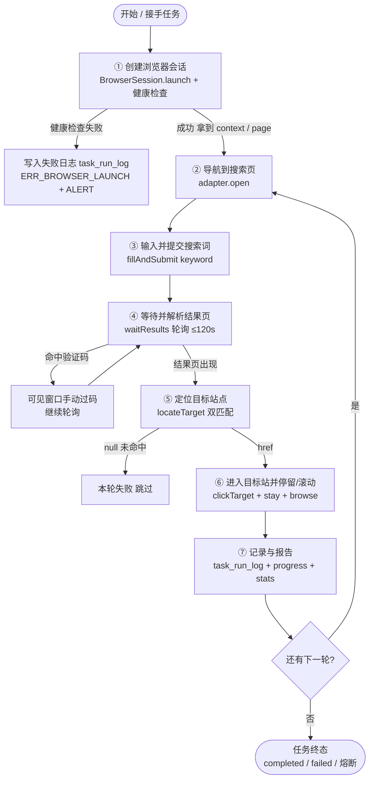

# autoclaw 分步操作需求文档（Stepwise PRD）

> **版本**：stepwise v1 ｜ **形态**：分步开发 / 分步测试蓝图（非传统 PRD 故事）
> **语言**：中文 ｜ **读者**：在**另一台电脑**上接手、并计划「**分步开发、每步单独测试**」的开发者（极可能是技术负责人本人）
> **事实来源**：本仓库源码（`core/browserSession.js`、`core/adapters/baiduAdapter.js`、`core/taskEngine.js`、`core/taskConfig.js`、`config/defaults.js`、`README.md`、`.env.example`、`package.json`）+ 综合接手文档 `docs/prd-autoclaw-handoff.md` 的已核实事实与已知坑。
> ⚠️ 本文与 `prd-autoclaw-handoff.md` 是**互补关系**：handoff 文档讲「整系统如何跑通、有哪些坑」；本文档讲「如何把整条自动化链路拆成 N 个**独立、可单独开发、可单独测试**的步骤模块」。凡有冲突以 handoff 文档的工程事实为准。

---

## 1. 文档目的与读者

这份文档不是功能故事集，而是一张 **「分步实现 + 每步单独验证」的施工图**。

它的读者会做这样一件事：

> 在一台**新电脑**上 clone/拷贝代码，不一次性把整套系统跑起来，而是**按步骤编号逐个实现**，并且**每实现一个步骤，就用一个最小脚本 / 单测验证这一步本身正确**——不依赖整套服务、不依赖数据库、不依赖 worker/socket，全部步骤各自绿了，最后才把它们串成完整任务。

为什么需要这种拆法？因为现状代码把整条链路**耦合在 adapter 方法 + taskEngine 的 round 循环里**（见 §2），想单独测其中任何一步都很困难；而历史上几个真实痛点（见 §1.1）恰恰都出在某一步没被单独验证过。

### 1.1 驱动「分步 + 独立可测」的已知历史痛点

| # | 痛点（来自修复会话 / handoff §5.4/§7.2） | 为什么必须「独立、可测」 |
|---|------------------------------------------|---------------------------|
| H-1 | **「连打开浏览器都有问题」是真实痛点**：服务用 `nohup & disown` 脱离桌面会话 → fork 出的 worker 弹不出 GUI Chrome，静默崩溃；临时 profile 锁 `ProcessSingleton`；启动失败错误被吞（只发 ALERT，不落 `task_run_log`）。 | **「创建浏览器会话」必须作为第一个、可单独测试的步骤**，且必须带**健康检查**（能起来 + 能拿到可用的 page），失败必须可追踪。 |
| H-2 | 百度风控 / 验证码：隐身参数已加（`--disable-blink-features=AutomationControlled` + 拟真 UA），但仍可能弹验证码；adapter 是**轮询等人模型**（`search` 步骤 D 上限 120000ms），不是 fail-fast。 | 「等待结果 / 验证码」这一步必须能**独立注入「验证码页」vs「正常结果页」两种场景**分别验证，不能等整轮跑挂了才发现。 |
| H-3 | 当前整条流程耦合在 `baiduAdapter.open/search/locate` + `taskEngine.runRound` 循环里，单步无法脱离整套系统测试。 | 拆分目标是**解耦**：每步有明确输入 / 输出 / 前置依赖 / 独立测试入口。 |
| H-4 | `ERR_BROWSER_LAUNCH` 仅 `emit` 一条 ALERT，不写 `task_run_log`（handoff T-1），叠加 H-1 的「0 日志」现象时极难定位。 | 「记录与报告」（步骤⑦）必须保证**任一步失败都落盘**，启动失败尤其不能丢。 |

---

## 2. 整体操作流程概览

### 2.1 现状耦合分析（先看清问题）

当前主线被「钉死」在一条顺序调用链里：

```
taskEngine.run()
  └─ session.launch()  +  session.newContext()          ← 浏览器会话（唯一入口，无健康检查出口）
       └─ for round of rounds:
            └─ runRound(page):
                 ├─ adapter.open(page)                  ← 导航
                 ├─ adapter.search(page, kw)            ← 填词+提交+轮询等结果(ABCD 全绑在一个方法里)
                 ├─ adapter.locateTarget(page, target)  ← 定位
                 ├─ adapter.clickTarget(page, href)     ← 进入目标站
                 ├─ _stayDwell(page)                    ← 停留
                 ├─ _inSiteBrowse(page)                 ← 滚动/站内浏览
                 └─ page.close()
```

**耦合点**：`search()` 把「填词 → 提交 → 轮询等结果 → 检测验证码」四件事绑成一个方法；`runRound` 把「定位 → 进入 → 停留 → 浏览 → 关闭」顺序写死；浏览器启动失败只走 ALERT、不落库。**任一环节想单独验证，都得先把整套引擎跑起来。**

### 2.2 目标流程（分步后）

下图是本文建议的**主线**，每个方块 = 一个独立步骤模块（详见 §3）。



> 说明：步骤①产出 `BrowserContext`（含已就绪的 UA / 视口 / 隐身参数），后续步骤②~⑥都复用这一个 context 上 `newPage()` 出来的 `Page` 对象；步骤⑦是横切关注点，每一步结束都要回写日志与进度（见 §3 步骤⑦）。

---

## 3. 步骤拆分（核心章节）

### 3.1 步骤总览

| 编号 | 步骤名 | 对应现状代码 | 是否关键步骤（失败判本轮失败） | 核心产出 |
|------|--------|--------------|-------------------------------|----------|
| **①** | 创建浏览器会话 | `browserSession.launch()` + `newContext()` | 是（无会话则全崩） | `BrowserContext`（`page` 可由其 `newPage()` 得到） |
| **②** | 导航到搜索页 | `baiduAdapter.open(page)` | 是 | page 已到 baidu 首页，`#kw` 已挂载 |
| **③** | 输入并提交搜索词 | `baiduAdapter.search` 的步骤 A/B/C（填词+提交） | 是 | 搜索已提交（page 即将/已进入结果页） |
| **④** | 等待并解析结果页 | `baiduAdapter.search` 的步骤 D（轮询+验证码检测） | 是 | `{ hasResults, captchaDetected }` |
| **⑤** | 定位目标站点 | `baiduAdapter.locateTarget(page, target)` | 是 | `href`（真实落地地址）或 `null` |
| **⑥** | 进入目标站并停留/滚动 | `clickTarget` + `_stayDwell` + `_inSiteBrowse` | 进入=是；停留/滚动=软步骤 | 目标站内停留 + 拟人滚动完成 |
| **⑦** | 记录与报告 | `task_run_log` 写入 + `progressEvent` 推送 + 统计 | 横切（每步都触发） | 落库行 + 进度事件 + 成功率快照 |

> **合并 / 细分说明**：建议在目标代码里把现状 `search()` 物理拆成「③ 提交」与「④ 等待」两个方法（`fillAndSubmit` / `waitResults`），这样两步才能各自独立测试（H-2 驱动）。步骤⑥把现状的 `enter` 折进「停留/滚动」，因为 `clickTarget` 是瞬时的 `goto`，无独立验证价值，与停留同处「已进入目标站」这一状态；若团队希望更细，可再拆出「进入目标站」独立步骤。

### 3.2 各步骤详细契约

> 每个步骤都用同一套字段描述：**职责边界 / 输入 / 输出 / 前置依赖 / 独立测试方式 / 风险·易错点**。其中「独立测试方式」是强制项——每一步都必须能在**不启动整套服务、不连数据库、不跑 worker/socket** 的前提下单独验证。

---

#### ① 创建浏览器会话（**最该先独立测的一步** ⭐）

| 字段 | 内容 |
|------|------|
| **职责边界** | 只做一件事：用本机 Chrome（`channel:'chrome'`、`headless:false`）起一个**可见窗口**的浏览器，拿到一个带隐身参数 / 拟真 UA / 视口（1280×900）的 `BrowserContext`；并做一次**健康检查**证明「能起来、能拿到可操作的 page」。不做任何导航、不解析结果、不写业务日志（写失败日志属步骤⑦，但本步失败要能触发它）。 |
| **输入** | 可选 `proxy`（F-18 代理注入入口，V1 不实现）；环境：`AUTOCLAW_CHROME_USER_DATA`（持久化 profile，强烈建议手动登录百度降验证码）、`AUTOCLAW_CHROME_PATH`（指定 Chrome 路径，否则自动探测）。 |
| **输出** | 成功：`BrowserContext`（已是持久化上下文，含 UA/视口；`this.browser` 同步就绪）。健康检查通过标志（见下）。失败：抛带 `code = ERR_BROWSER_LAUNCH` 的错误。 |
| **前置依赖** | 无（整条链路起点）。 |
| **独立测试方式** | **写一个最小 node 脚本（如 `scripts/smoke-launch.js`）即可，无需整套系统**：<br>1) `require('../core/browserSession')`，`new BrowserSession()`，`await s.launch()`；<br>2) 断言返回的 `context` 非 null；<br>3) `const page = await context.newPage()`；`await page.goto('about:blank')`；`const ok = await page.evaluate(() => 1 + 1 === 2)` 断言 `ok === true`（证明 page 真能执行 JS、不是空壳）；<br>4) 断言 `context.browser()` 非 null；<br>5) `await s.close()` 断言临时 profile 清理 / 进程树释放。三件事全过 = 「能起来 + 能拿到 page」。<br>**这就是直接对应 H-1 的验证手段**：若处于 nohup/disown 脱离桌面会话，第 1 步就会抛 `ERR_BROWSER_LAUNCH`（或静默崩），脚本立即暴露问题，而不是等整套任务 `failed + 0 日志` 才发现。 |
| **风险·易错点** | ① **必须用交互桌面会话启动**（双击 `start-win.bat` 或挂在桌面会话的「后台任务」），**绝不用 `nohup & disown`**（H-1，最致命）；<br>② 临时 profile 有 `ProcessSingleton` 锁，上一次没清干净会启动失败——`close()` 已用 `taskkill /PID /F /T` 强杀进程树兜底，测试时务必确认 `close()` 被调用；<br>③ `AUTOCLAW_CHROME_USER_DATA` 持久化 profile 同样有锁，**多任务并行会撞锁**，用持久化 profile 时必须单任务串行；<br>④ `headless` 必须为 `false`（需要 GUI），纯无桌面服务器跑不起来（H-1/坑4）；<br>⑤ **启动失败只发 ALERT、不落库**（handoff T-1）——本步失败时，步骤⑦必须兜底写一条 `task_run_log`，不能让它「哑火」。 |

> **健康检查推荐契约（供工程师落地）**：把「起浏览器 + 拿到可操作 page」封装成 `BrowserSession.healthCheck(ctx)`，约定返回 `{ ok: boolean, page?: Page, reason?: string }`；步骤①的「独立可测性」即等价于「`healthCheck` 能稳定返回 `ok:true`」。这应是开发者实现完步骤①后要过的第一道关。

---

#### ② 导航到搜索页（open）

| 字段 | 内容 |
|------|------|
| **职责边界** | 在已有 page 上 `goto` 到搜索首页（百度 `https://www.baidu.com`），只确认搜索框 `#kw` **已挂载进 DOM（`state:'attached'）**。不做填词、不提交、不等结果。 |
| **输入** | `Page`（来自①的 `context.newPage()`）；目标 URL（默认 `BAIDU_HOME`）；搜索框选择器（默认 `#kw`）。 |
| **输出** | page 已到搜索首页；`#kw` 在 DOM 中（`attached`）；非验证码页。失败抛明确错误（如「打开百度首页失败（重试后仍失败）」）。 |
| **前置依赖** | ① 完成，已拿到可用的 `page`。 |
| **独立测试方式** | 复用①的 context 起一个 page，直接调 `adapter.open(page)`，断言：<br>1) `page.url()` 含 `baidu.com`；<br>2) `await page.$('#kw')` 非 null；<br>3) 非验证码页（`_isCaptchaPage` 为 false）。<br>可用 Playwright 的 `page.route` 拦截网络、模拟 `goto` 偶发 `ERR_ABORTED` 验证内置重试（代码已有 3 次重试 + 3s 退避）确实生效；也可断言连续多次调用后最终成功。 |
| **风险·易错点** | ① 历史坑：`#kw` 在某些布局下被判定为 `hidden`，原 `state:'visible'` 会卡 15s——当前已改为 `attached`，测试时**构造一个 hidden 输入框的 fixture 也要能过**；<br>② open 阶段也可能被风控重定向到验证码页，测试需覆盖「open 即落验证码页」场景（断言提前报错或进入等待）；<br>③ 网络抖动导致的 `goto` 失败由内置重试兜底，但测试要确认重试耗尽后才报「打开百度首页失败」。 |

---

#### ③ 输入并提交搜索词（fill + submit）

| 字段 | 内容 |
|------|------|
| **职责边界** | 在已打开的搜索页上**填词 + 提交**，提交动作返回即结束（**不等结果页**）。对应现状 `search` 的步骤 A（等 `#kw` attached）/ B（evaluate 写值）/ C（evaluate 触发 `form.requestSubmit()` 或点 `#su`）。 |
| **输入** | `Page`（已在搜索首页）；`keyword`（字符串）。 |
| **输出** | 搜索词已写入 `#kw`，表单已提交（page 开始跳转或已到结果页 URL）。**不产出结果页状态**（那是步骤④的事）。 |
| **前置依赖** | ② 完成（page 在搜索首页、`#kw` 可用）。 |
| **独立测试方式** | page 已在百度（可由步骤②产出，或测试里直接 `page.goto(BAIDU_HOME)` 后用 fixture 保证 `#kw` 存在），调 `fillAndSubmit(page, keyword)`，断言：<br>1) 提交后 `page.url()` 变为结果页（含 `baidu.com/s` 或 `baidu.com/...&wd=` 之类），或 page 已触发导航；<br>2) 可选：注入一个「`#kw` 为 hidden」的 fixture，断言 evaluate 写值方式仍能成功（绕开可见性）。**本步测试必须在远小于 120s 内完成**——因为提交动作本身不轮询。 |
| **风险·易错点** | ① 必须用 `page.evaluate` 写值 + 提交（现状已修），不能直接 `fill()`/`press(Enter)`——否则 `#kw` hidden 时失败；<br>② 步骤 A 子超时 10s、B 6s、C 6s（最坏 22s）< 外层 `actionTimeoutMs`（默认 150000）；测试要确保「分步错误优先于外层超时抛出」（即报「填写搜索词超时」而非笼统「动作超时」）；<br>③ 不要把「等待结果」混进来，否则本步无法独立快速验证。 |

---

#### ④ 等待并解析结果页（waitResults · 轮询 + 验证码）

| 字段 | 内容 |
|------|------|
| **职责边界** | 提交后**轮询**等待结果容器 `#content_left` 出现；同时持续**检测验证码页**（`wappass.baidu.com` / 标题含「验证」/ DOM 含 `#captcha .passMod .tuxing input[name=captcha]`）。结果出现即成功；命中验证码则提示用户在可见窗口手动过码并继续轮询；超过上限（**120000ms**）仍无结果 / 未过码则抛 `ERR_BAIDU_CAPTCHA`。 |
| **输入** | `Page`（已提交搜索）；轮询上限（默认 `CAPTCHA_WAIT_MS=120000`）；轮询间隔（默认 `2000ms`）。 |
| **输出** | `{ hasResults: boolean, captchaDetected: boolean }`；正常情况 `hasResults=true`；验证码未过超上限时抛 `ERR_BAIDU_CAPTCHA`。 |
| **前置依赖** | ③ 完成（搜索已提交）。 |
| **独立测试方式** | **两条路径分别测，都能脱离整套系统**（H-2 核心诉求）：<br>**a) 正常结果页路径**：用 `page.setContent()` 注入一段含 `#content_left` 的结果页 fixture HTML，调 `waitResults(page)`，断言 `hasResults===true` 且**很快返回**（远不需要 120s）。<br>**b) 验证码页路径**：用 `page.setContent()` 注入含 `#captcha` / `.passMod` 的 fixture，调 `waitResults(page)`，断言 `captchaDetected===true`，且在 120s 上限内抛 `ERR_BAIDU_CAPTCHA`。<br>**更纯的单元测试（完全不需要真实浏览器）**：直接对 `adapter._isCaptchaPage(mockPage)` 做断言——用 mock page 分别返回 `url='https://wappass.baidu.com/...'`、`title='百度安全验证'`、`evaluate 命中 #captcha`，断言三种情况都识别为验证码页；再返回正常页断言为 false。这一步验证直接对应「验证码可独立测」。 |
| **风险·易错点** | ① 轮询上限 **必须 ≥ 120000ms**，外层 `actionTimeoutMs` 默认 150000、且**绝不能调回 30000**（handoff 坑2/T-4）——否则 search 会在验证码逻辑跑起来前就被超时干掉，表象是「动作超时」、本质是永远到不了验证码处理；<br>② 「卡在 search 步骤很久不动」通常是**正在等用户手动过验证码**，不是死循环——测试与运维都要认得这个提示；<br>③ 隐身参数只能**降低**被识别概率，根治靠持久化 profile 手动登录（见①），测试验证码路径时要预留「已登录态极少触发」的前提。 |

---

#### ⑤ 定位目标站点（locateTarget）

| 字段 | 内容 |
|------|------|
| **职责边界** | 在结果页上做**双匹配**：取前 10 条结果，标题含任一 `titleKeywords` **且** 真实落地地址含 `targetDomain`，返回首个命中的真实 URL；未命中返回 `null`。 |
| **输入** | `Page`（结果页）；`target = { domain: string, titleKeywords: string[] }`。 |
| **输出** | 命中则返回**真实落地地址** `href`（经 `resolveFinalUrl` 解析百度跳转链接）；未命中返回 `null`。若落在验证码页，提前抛 `ERR_BAIDU_CAPTCHA`。 |
| **前置依赖** | ④ 完成（`hasResults=true`、结果页已出现）。 |
| **独立测试方式** | 用 `page.setContent()` 注入 fixture 结果页，断言：<br>1) **命中 fixture**：前 10 条中某条标题含 `titleKeyword` 且真实地址含 `domain` → 返回该真实 URL；<br>2) **未命中 fixture**：全部不含关键词或域名 → 返回 `null`；<br>3) **跳转链接解析**：结果 `href` 是 `baidu.com/link?url=...` 时，断言 `resolveFinalUrl` 解析出真实落地地址后再做域名匹配；<br>4) 也可用纯函数单测双匹配逻辑（mock DOM 节点），不需真实浏览器。 |
| **风险·易错点** | ① 百度结果为自家跳转链接，必须 `resolveFinalUrl`（带 3000ms 超时）解析真实地址后再匹配，否则永远匹配不上 `targetDomain`；<br>② 只取前 10 条（`items.slice(0,10)`），测试要确认第 11 条之后的命中不会被误取；<br>③ 若步骤④漏过验证码页，这里要兜底识别并抛错，不能默默返回 `null` 误判「未命中」。 |

---

#### ⑥ 进入目标站并停留/滚动（enter + stay + browse）

| 字段 | 内容 |
|------|------|
| **职责边界** | 拿到 `href` 后：进入目标站（`clickTarget` → `page.goto(href)`）；**停留** `staySeconds`（运行时 ±20% 抖动）；**站内拟人浏览**：寻找「联系/关于」页并做上滑/下滑随机幅度（300–800px）、随机间隔（1–2s）滚动。进入是**关键步骤**（失败判本轮失败），停留/滚动是**软步骤**（失败仅记录、不判本轮失败）。 |
| **输入** | `Page`；`href`（来自⑤）；`anthropic = { staySeconds, scrollUp, scrollDown, ampMin, ampMax, intervalMin, intervalMax }`（默认见 `config/defaults.js`）。 |
| **输出** | 目标站内停留完成 + 滚动完成（可选：已进入联系/关于页）。软失败时（如站内未找到联系/关于页）仍滚动完成、仅记软错误。 |
| **前置依赖** | ⑤ 完成（拿到 `href`）。 |
| **独立测试方式** | 三部分可分别独立测，多数**用 mock page 即可，无需真实浏览器**：<br>1) **enter**：`page` + fixture `href`，调 `clickTarget(page, href)`，断言 `page.url()===href`；<br>2) **stay**：用 mock `sleep`/`page` 或直接 spy `setTimeout`，断言停留时长落在 `[staySeconds*0.8, staySeconds*1.2]` 区间；<br>3) **browse / `_doScroll`**：用 mock page（mock `mouse.wheel`、`waitForTimeout`），断言调用了 `scrollUp+scrollDown` 次 `mouse.wheel`、每次幅度在 `[ampMin, ampMax]`、间隔在 `[intervalMin, intervalMax]`；<br>4) **`_findContactLink`**：用 fixture HTML（含「联系我们」「/about」等链接）断言能正确识别并返回完整 URL；用「无联系/关于链接」的 fixture 断言返回 `null` 且触发软错误。 |
| **风险·易错点** | ① 进入目标站若触发目标站自身风控/跳转，要能被超时与重试兜住（软失败不应阻断整轮时，注意 enter 是关键步骤、browse 是软步骤，二者失败语义不同）；<br>② 拟人参数随机性导致「停留时长」「滚动次数」只能在区间内断言，测试不要写死精确值；<br>③ 站内浏览依赖目标站存在「联系/关于」链接，缺失时应降级为「当前页滚动」并记软错误，测试要覆盖这条降级路径。 |

---

#### ⑦ 记录与报告（横切 · 每步都触发）

| 字段 | 内容 |
|------|------|
| **职责边界** | **横切关注点**：每一步（含①启动、②~⑥）结束都要回写运行记录与进度。约定一个统一步骤执行器 `stepExecutor(name, fn, { retry, timeout })`：执行 fn → 成功/失败都写 `task_run_log`（含 `step` / `step_status` / `error` / `round` / `task_id`），并 `emit` 对应 `progressEvent`；累计成功率快照。特别：**任一步失败（含浏览器启动失败 `ERR_BROWSER_LAUNCH`）都必须落库一条失败行**，不能只发 ALERT。 |
| **输入** | 步骤名、步骤函数、重试次数（`maxRetry` 默认 2）、超时（`actionTimeoutMs` 默认 150000）、`taskId` / `round` 上下文。 |
| **输出** | `task_run_log` 行（持久化）；`progress` / `alert` socket 事件；成功率统计 `{ total, success, fail, failRate }`。 |
| **前置依赖** | 逻辑上依赖①~⑥每一步；但执行器本身可独立实现与测试。 |
| **独立测试方式** | **完全不需要真实浏览器、不需要整套系统**：用临时 SQLite 文件或 in-memory DB，直接调 `stepExecutor` / 日志写入函数，传入一个会抛错的 fn（如 `throw new Error(...).code=ERR_BROWSER_LAUNCH`），断言：<br>1) `task_run_log` 出现一条 `step_status='failed'`、`error` 含 `ERR_BROWSER_LAUNCH`、`task_id` 存在（修复 handoff T-2：返回要带 `taskId`）的行；<br>2) 进度事件结构正确（`event_type` / `step` / `message` 齐备）；<br>3) 熔断阈值：连续注入多个失败，断言失败率 > `failRateThreshold`（默认 0.3）时触发 `circuit-break` 告警。这一项直接修复 H-4（启动失败落盘）。 |
| **风险·易错点** | ① **现状最大坑**：`taskEngine.run()` 的 `launch` 失败只 `emit ALERT` 不写 `task_run_log`（handoff T-1）——步骤⑦必须兜底；<br>② `getRunLogs` 返回缺 `taskId`（handoff T-2），按任务聚合/回查不便，步骤⑦输出要补 `taskId`；<br>③ 日志缓冲落库要防丢：进程异常退出时内存缓冲应先 flush 再退出；<br>④ 横切执行器一旦本身抛错会掩盖业务错误，测试要确认执行器自身异常也能被记录。 |

---

## 4. 需求池（P0 / P1 / P2）

> 优先级：P0=必须，P1=应做，P2=可选。P0 聚焦「分步独立可测」与「错误可追溯」。

### P0 — 必须

| 编号 | 需求 | 说明 / 关键约定 |
|------|------|----------------|
| **P0-1** | **步骤①浏览器会话可独立创建且可测** | `BrowserSession.launch()` 必须能在不启动整套服务的前提下单独调用，且带**健康检查**（`healthCheck(ctx)`：能 `newPage` + 能 `evaluate`）证明「能起来、能拿到 page」。这是最高优先级，直接对应 H-1。 |
| **P0-2** | **浏览器启动失败必须落盘可追溯** | `ERR_BROWSER_LAUNCH` 及任何步骤失败都必须写 `task_run_log`（步骤⑦兜底），不能只发 ALERT（修复 handoff T-1）。 |
| **P0-3** | **步骤④验证码可独立测试** | 必须能分别注入「正常结果页」与「验证码页」验证等待/检测逻辑；`_isCaptchaPage` 必须可用 mock page 纯单测（对应 H-2）。 |
| **P0-4** | **每步有独立验证脚本 / 单测** | 7 个步骤各自配一个最小验证入口（如 `scripts/smoke-launch.js`、step 的 `*.test.js`），不依赖 DB / worker / socket；全部绿了才允许串联。 |
| **P0-5** | **步骤②④⑤⑥可跑在最小 page fixture 上** | 导航/等待/定位/停留滚动必须能在「`context.newPage()` + `setContent` fixture 或 mock page」上验证，不要求真实联网跑到百度。 |
| **P0-6** | **`search` 物理拆分为「提交」与「等待」** | 目标代码把现状 `search()` 拆成 `fillAndSubmit`（③）与 `waitResults`（④）两个导出方法，使两步可独立测（H-2/H-3）。 |
| **P0-7** | **错误码体系保持** | `ERR_BROWSER_LAUNCH` / `ERR_BAIDU_CAPTCHA` / `ERR_NO_TARGET` / `ERR_ADAPTER_FAIL` / `ERR_TIMEOUT` 等沿用 handoff §4.4，步骤边界不变更错误语义。 |

### P1 — 应做

- **代理注入入口落实**：`browserSession.launch(proxy)` 已有 `proxy.httpProxy` 入参（F-18），P1 落实真实代理设置。
- **每步允许中途人工介入**：尤其步骤④验证码等待，需把「等待窗口」做成可配置、可观测（可见窗口提示文案保持）。评估是否其他步骤（② open、⑥ 进入目标站）也会遇验证码。
- **步骤间状态传递标准化**：明确上下文如何在步骤间传递（共享 `Page` 对象 vs 不可变 state bag），供串联时复用（见 §6 待确认）。
- **持久化 profile 单任务串行守卫**：用 `AUTOCLAW_CHROME_USER_DATA` 时强制单活跃任务，避免 `ProcessSingleton` 锁冲突（handoff 坑5）。
- **`getRunLogs` 补 `taskId`**：修复 handoff T-2，返回对象带 `taskId`。

### P2 — 可选

- **步骤级可观测 / 单步重跑**：支持失败后在某一步断点续跑，而非整轮重来。
- **谷歌 adapter 同构拆分**：`googleAdapter` 按相同 7 步契约拆分（当前仅百度实测，谷歌需 VPN）。
- **`headless` 可选化**：`AUTOCLAW_HEADLESS` 当前预留未用，若未来支持无头，步骤①健康检查逻辑需相应调整（可见窗口假设不再成立）。
- **运行日志可视化时间轴**：把 `task_run_log` 渲染为步骤/状态/耗时时间轴（handoff P1）。

---

## 5. 分步开发建议（执行顺序）

> 核心原则：**按编号顺序实现，每步配一个独立验证脚本/单测，全部绿了再串起来。**

1. **先实现并验证 ①**（创建浏览器会话 + 健康检查）。
   - 交付物：`scripts/smoke-launch.js`，在新电脑交互桌面会话双击 `start-win.bat` 后跑通：`launch → newPage → evaluate(1+1===2) → close` 全过。
   - 这是整条链路的地基，**先在目标机器上确认这步稳定**，再往下走——历史 H-1 的痛苦就是跳过了这步直接跑整套。

2. **实现 ⑦ 的日志/进度骨架**（可先最小实现：失败必落库 + 进度事件结构）。
   - 理由：有了它，后续每步的失败都能被记录与回看，自成闭环；且它自身可用 in-memory DB 独立测（见 §3 步骤⑦）。

3. **依次实现 ② → ③ → ④ → ⑤ → ⑥**，每一步都配 fixture/mock 单测：
   - ② 导航：fixture 保证 `#kw` 存在（含 hidden 场景）。
   - ③ 提交：断言提交即返回、不轮询。
   - ④ 等待：正常页 fixture + 验证码页 fixture + `_isCaptchaPage` mock 单测（三件套）。
   - ⑤ 定位：命中 / 未命中 / 跳转链接解析 三套 fixture。
   - ⑥ 进入/停留/滚动：enter 断言 URL；stay 断言区间；`_doScroll`/`_findContactLink` mock 单测 + 降级路径。

4. **串联**：用 `taskEngine` 编排「① 起会话 → 循环 ②~⑥ → ⑦ 记录」，接回 handoff 文档的 worker/socket/DB 主链路。

5. **回归**：跑 `node --test test/*.test.js` 确认不破坏现有 126/126 单测；提交一个真实百度任务，观察可见 Chrome 窗口执行。

> 验收闸口：**任何一步若没有对应的独立验证脚本/单测通过，就不进入下一步实现。** 这是本文档与 handoff 文档最大的视角差异——handoff 关心「整系统怎么跑」，本文档关心「每一步怎么单独证明它对」。

---

## 6. 待确认问题

> 以下为拆分过程中仍在摇摆、需技术负责人拍板的点（不影响步骤①先行落地）。

1. **步骤间状态如何传递？** 现状是共享 `page` 对象贯穿整轮。是否改为「不可变 state bag（`{ context, page, round, target }`）」显式传递，以便单步测试时只构造所需字段？这影响每个步骤的签名契约。
2. **是否每步都允许中途人工介入过验证码？** 已确认步骤④（等待结果）会遇验证码并轮询等人；但步骤②（open 时）与步骤⑥（进入目标站时）是否也会遇风控验证码？若会，是否也要套用「轮询等人 + 可见窗口提示」模型，还是直接失败重试？
3. **`search` 拆分的粒度？** P0-6 建议物理拆成 `fillAndSubmit`（③）与 `waitResults`（④）两个导出方法；也可保留 `search()` 内部顺序调用、仅在中间加「提交完成检查点」供测试钩子。选哪种？
4. **步骤⑦的「记录」落库形态？** 复用现有 `task_run_log`（`step` / `step_status` / `error` 列）是否已够细？是否需要新增「步骤级」更细的表（如把 ABCD 子步骤也各记一行）以便精准定位卡点？
5. **`headless` 未来是否启用？** `AUTOCLAW_HEADLESS` / `AUTOCLAW_SCREENSHOT` 当前预留未用（`.env.example`）。若未来支持无头，步骤①「健康检查 = 能拿到可见 page」的假设要改写，是否现在就预留？
6. **编排归属**：步骤模块是否只暴露「纯函数 / 薄适配器方法」，轮次状态（平台×关键词展开、熔断、暂停/停止安全点）仍完全由 `taskEngine` 负责？还是步骤模块也承担部分编排？
7. **持久化 profile 的并发守卫**：用 `AUTOCLAW_CHROME_USER_DATA` 时，单任务串行守卫放在哪一层（taskManager 单活跃守卫已存在，是否复用）？

---

## 附录：本文档相对 `prd-autoclaw-handoff.md` 新增的视角

| 维度 | handoff 文档 | 本文档（stepwise）新增视角 |
|------|--------------|----------------------------|
| 读者目标 | 「把整套服务跑通、提交第一个百度任务」 | 「按步骤逐个实现、每步单独测绿再串联」 |
| 主线表达 | 架构图（进程/worker/socket/DB 维度） | **步骤级流程图**（①~⑦ 主线 + 验证码回环 + 失败落库分支） |
| 浏览器启动 | 作为 `taskEngine.run()` 内一行 `session.launch()`，失败只发 ALERT | **升格为第①个独立步骤 + 强制健康检查 + 失败必落库**（H-1/H-4） |
| search | 一个方法（ABCD 绑死），轮询 120s | **拆成③提交 + ④等待两个独立可测步骤**，验证码可注入 fixture 单测（H-2） |
| 测试入口 | `node --test` 全量回归 + 真任务冒烟 | **每步配最小独立验证脚本 / fixture / mock 单测**，不依赖整套系统 |
| 验证码 | 「轮询等人模型」的描述 | **两种场景（正常页 / 验证码页）+ `_isCaptchaPage` mock 单测**的具体验证方式 |
| 记录 | `task_run_log` 表结构 + T-1 已知缺陷 | **步骤⑦横切执行器契约**：任一步失败（含启动）必须落库、补 `taskId` |
| 串联顺序 | 无 | **§5 分步开发顺序 + 验收闸口**（任一步无独立测试通过不进下一步） |

> 一句话总结新增价值：**handoff 告诉你「系统长什么样、怎么跑、有哪些坑」；本文档告诉你「怎么把它拆开、每一步怎么单独证明它对」——尤其把历史上「连打开浏览器都出问题却查不到原因」的痛点，变成「步骤①一个最小脚本就能当场暴露」的可测单元。**
