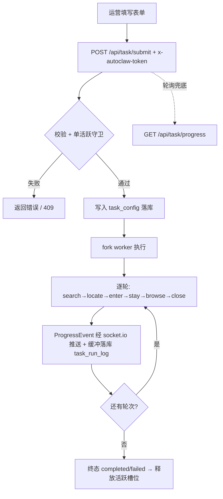
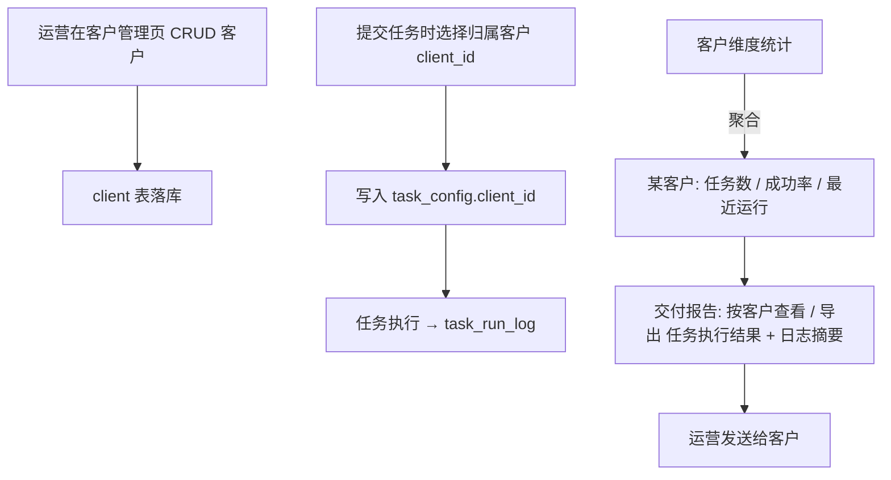

# autoclaw v2 产品需求文档（PRD）

> 版本：v2.0 ｜ 形态：简单 PRD（整合优化版） ｜ 语言：中文
> 整合说明：本仓库内初版 PRD / 增量 PRD / 架构 / 决策记录等历史 `.md` 文档**未找到**，故以**实际代码为唯一事实来源**对齐（核心 `taskConfig.js`、`config/db.js`、`scripts/schema.sqlite.sql`、前端 `index.html`/`config.js`、路由 `taskRoutes.js`、部署 `docs/ACCESS-FAQ.md`）。本版将散落、矛盾的临时决策收敛为一致表述，并补入「客户」服务线。

---

## 0. 既定技术约束（已确认事实，PRD 反映、不质疑）

| 维度 | 约定 |
|---|---|
| 部署形态 | Windows 原生 Node 服务，监听 `0.0.0.0:7788`（裸域名经 `netsh portproxy` 80→7788 转发兜底） |
| 技术栈 | Node.js v22 + Express 4 + socket.io 4 + Playwright 1.44 |
| 浏览器 | 复用本机已装 Chrome（`channel: 'chrome'`），`headless: false` 弹真实可见窗口，隔离 `userDataDir` |
| 平台范围 | 本地先只跑**百度**；谷歌需 VPN 才能测试，**先预留**（适配器已就位） |
| 存储 | 先用 **SQLite**（`AUTOCLAW_DB_TYPE=sqlite`，库文件 `data/autoclaw.db`）；后续接 MySQL（双后端 `query` 适配层已预留） |
| 鉴权 | 简单 token（`x-autoclaw-token`，开发期值 `autoclaw-dev`），单账号，不做多租户 |
| 并发 | 单活跃任务守卫（决策 A2）：运行中提交返回 `409 ERR_TASK_RUNNING`；终态释放活跃槽位（决策 A4） |

---

## 1. 产品目标

autoclaw 是一款面向 SEO 推广的 Windows 原生自动化工具：运营配置「搜索平台 + 关键词 + 目标站点 + 拟人动作参数」的任务后，工具自动打开搜索页、在结果页定位目标网址、进入目标页停留并拟人化滚动，循环多轮，以提升目标站点在百度/谷歌的自然排名曝光。它由工作室内部运营使用，并直接服务于外部客户的交付——每个任务可归属到具体客户，系统据此生成客户维度的统计与交付报告，支撑工作室对客户做效果交付。当前阶段专注百度（谷歌预留），保持轻量、不扩展为通用中台。

---

## 2. 用户角色

- **工作室运营 / 操作人（主角色）**：配置并提交任务、实时监控进度、管理客户档案、按客户导出交付报告。是系统的唯一操作方。
- **客户（被动角色）**：不直接操作系统；通过运营导出的交付报告，被动查看自己名下任务的效果（任务数、成功率、命中摘要）。

---

## 3. 用户故事

**作为运营：**
- 作为运营，我能勾选平台并填写关键词与目标站点，提交一个拟人化 SEO 任务，并立即看到它开始执行。
- 作为运营，我能实时看到任务进度（当前轮次/步骤/成功率），并在需要时暂停或停止。
- 作为运营，我能从历史配置回填表单，快速复用并重新运行同类任务。
- 作为运营，我能把任务归属到某客户，并查看该客户下所有任务的数量、成功率与最近运行时间。
- 作为运营，我能按客户导出/查看交付报告（任务执行结果 + 日志摘要），用于给客户做效果交付。

**作为客户（被动）：**
- 作为客户，我（被动）能收到运营导出的交付报告，了解我名下任务是否命中目标站点、成功率如何。

---

## 4. 需求池（P0 / P1 / P2）

### P0 — 必须（既有核心）

**P0-1 任务配置表单**
- 平台多选：百度 / 谷歌（默认百度勾选；谷歌为预留，本地未启用）。
- 搜索关键词：支持 `|` `、` `,` 分隔多组（服务端 `splitTokens` 拆分）。
- 目标站点：`targetDomain`（必填）+ `titleKeywords`（必填），双匹配定位规则。
- 拟人参数：停留秒数 `staySeconds`、上滑 `scrollUp`、下滑 `scrollDown`、幅度下限 `ampMin` / 上限 `ampMax`、间隔下限 `intervalMin` / 上限 `intervalMax`。
- 多平台调度模式 `run_mode`：串行（默认，百度→谷歌）/ 并发（预留）。
- 访问令牌 `token`（前端 `localStorage` 记忆，随请求头 `x-autoclaw-token` 发送）。
- 代理 `proxy`（表单可选入口；当前 V1 仅落库、未实际生效，见 Q5）。
- 校验与收口统一在服务端 `core/taskConfig.buildTaskConfig`（`targetDomain`/`titleKeywords` 缺失抛 `ERR_INVALID_CONFIG`）。
- 注：**循环轮数 = 平台数 × 关键词数**，由引擎 `buildRounds` 自动推导，非独立表单输入（是否允许用户手动覆盖见 Q4）。

**P0-2 任务提交即落库**
- `POST /api/task/submit`：先 `db.saveTaskConfig` 写入 `task_config`，再 `taskManager.submit` 启动 worker，保证「提交成功即落库 1 条」契约。
- 单活跃任务守卫：运行中提交返回 `409 ERR_TASK_RUNNING`。

**P0-3 百度 SEO 执行引擎**
- worker 驱动，每轮按步骤执行：`search → locate → enter → stay → browse → close`。
- `locate` 双匹配：结果标题含任一标题关键词 **且** 真实地址含目标域名，取前 10 条首个命中。
- `stay` / `browse` 做拟人化停留与滚动（幅度/间隔带随机抖动）。
- 轮次 = 平台数 × 关键词数，默认串行；全部轮次完成进入终态。

**P0-4 实时进度回传**
- socket.io 推送 `progress` 事件（客户端 `task:join` 进入 `taskId` 房间）；`alert` 事件额外推送熔断告警。
- `GET /api/task/progress?taskId=` 轮询兜底（降级路径）。
- 步状态 `step_status`（success/failed）驱动成功率统计。

**P0-5 任务生命周期控制**
- 暂停/停止：`POST /api/task/pause|stop` 或 socket `task:pause|task:stop`。
- 终态（`paused`/`stopped`/`completed`/`failed`）释放活跃槽位（决策 A4），允许重新提交。

**P0-6 历史与运行日志**
- `GET /api/task/history`：列历史配置（`created_at DESC`，前端可回填表单复用）。
- `GET /api/task/logs?taskId=`：回看某任务运行时间线 + 成功率统计（`{total, success, fail, failRate}`）。

**P0-7 SQLite 持久化**
- `AUTOCLAW_DB_TYPE=sqlite` 时写 `data/autoclaw.db`，首次打开幂等建表（`task_config` / `task_run_log`），运行记录内存缓冲定时批量落库。
- MySQL 接口兼容（`query` 适配层）预留，无需改路由/Manager。

### P0 — 必须（新增：服务客户）

**P0-8 客户管理（CRUD）**
- 客户增删改查：名称 `name` / 联系人 `contact` / 备注 `notes`；列表与详情；数据存新增 `client` 表。

**P0-9 任务归属客户**
- 提交任务时可选客户（`client_id`），写入 `task_config.client_id`；未绑定可为 `NULL`（历史/内部任务）。

**P0-10 客户维度统计**
- 按 `client_id` 聚合：名下任务数、整体成功率（基于 `task_run_log` `step_status`）、最近运行时间（`max(created_at)`）；客户列表/详情页展示。

**P0-11 交付报告**
- 按客户查看其所有任务的执行结果汇总（任务ID / 平台 / 关键词 / 目标站点 / 状态 / 成功率 / 最近运行），并支持导出（CSV / Markdown / HTML）。
- 基于现有 `task_config` + `task_run_log` 聚合即可交付「日志摘要」版；命中截图属新增采集能力（见 Q1 / P1）。

### P1 — 应做（后续增强）

- **谷歌平台**：VPN 可用后启用 `googleAdapter`（search/locate/enter/stay/browse/close 适配），串行先于百度。
- **任务模板复用**：把常用配置存为模板，提交时一键套用（当前已有历史回填，模板为增强）。
- **批量提交**：一次提交多组关键词 / 多客户任务，批量落库。
- **运行日志可视化时间轴**：进度页把 `task_run_log` 渲染为时间轴（步骤 / 状态 / 耗时 / 错误）。

### P2 — 可选（远期）

- **MySQL 接入**：`AUTOCLAW_DB_TYPE=mysql`，复用现有双后端 `query` 适配层。
- **操作审计**：记录运营操作（提交 / 暂停 / 停止 / 客户增删）到审计表。
- **定时任务**：按 cron / 周期自动提交任务。

---

## 5. 核心数据模型

> 字段命名与现有代码（`schema.sqlite.sql` / `config/db.js`）严格对齐；★ 为 v2 新增字段/表。

### 5.1 task_config（既有，任务配置）

| 字段 | 类型 | 约束 / 默认 | 说明 |
|---|---|---|---|
| `task_id` | TEXT | PK | UUID（`crypto.randomUUID()`） |
| `platforms` | TEXT(JSON) | NOT NULL | 平台数组，如 `["baidu"]` |
| `keywords` | TEXT(JSON) | NOT NULL | 关键词数组 |
| `target_domain` | TEXT | NOT NULL | 目标域名（双匹配之一） |
| `title_keywords` | TEXT(JSON) | NOT NULL | 标题关键词数组（双匹配之一） |
| `stay_seconds` | INTEGER | DEFAULT 15 | 目标页停留秒数 |
| `scroll_up` | INTEGER | DEFAULT 3 | 上滑次数 |
| `scroll_down` | INTEGER | DEFAULT 3 | 下滑次数 |
| `amp_min` | INTEGER | DEFAULT 300 | 滚动幅度下限(px) |
| `amp_max` | INTEGER | DEFAULT 800 | 滚动幅度上限(px) |
| `interval_min` | REAL | DEFAULT 1.0 | 动作间隔下限(秒) |
| `interval_max` | REAL | DEFAULT 2.0 | 动作间隔上限(秒) |
| `run_mode` | TEXT | DEFAULT 'serial' | 串行 / 并发（并发预留） |
| `fail_rate_threshold` | REAL | DEFAULT 0.3 | 熔断失败率阈值 |
| `max_retry` | INTEGER | DEFAULT 2 | 单步最大重试 |
| `action_timeout_ms` | INTEGER | DEFAULT 30000 | 单步超时(ms) |
| `status` | TEXT | DEFAULT 'pending' | `pending/running/paused/stopped/completed/failed` |
| `operator` | TEXT | NULL | 关联 `AUTOCLAW_TOKEN`（仅作标签） |
| `proxy_json` | TEXT | NULL | 代理配置（F-18：V1 预留未生效） |
| `client_id` | TEXT | NULL ★新增 | FK → `client.client_id`，未绑定为 NULL |
| `created_at` | TEXT | NOT NULL | 创建时间（UTC `YYYY-MM-DD HH:MM:SS`） |
| `updated_at` | TEXT | NULL | 状态更新时间 |

### 5.2 task_run_log（既有，运行记录）

| 字段 | 类型 | 约束 | 说明 |
|---|---|---|---|
| `id` | INTEGER | PK AUTOINCREMENT | 自增主键 |
| `task_id` | TEXT | NOT NULL | FK → `task_config.task_id` |
| `round` | INTEGER | NULL | 轮次序号 |
| `total_rounds` | INTEGER | NULL | 总轮次数（= 平台数 × 关键词数） |
| `platform` | TEXT | NULL | 本轮平台 |
| `keyword` | TEXT | NULL | 本轮关键词 |
| `step` | TEXT | NULL | `search/locate/enter/stay/browse/close` |
| `step_status` | TEXT | NULL | `pending/running/success/failed` |
| `event_type` | TEXT | NULL | `round_start/step/round_end/task_end/paused/stopped/alert` |
| `message` | TEXT | NULL | 人类可读描述 |
| `error` | TEXT | NULL | 错误信息（失败步/轮/任务级） |
| `timestamp` | TEXT | NOT NULL | 事件时间 |

### 5.3 client（★ 新增，客户档案）

| 字段 | 类型 | 约束 | 说明 |
|---|---|---|---|
| `client_id` | TEXT | PK | UUID |
| `name` | TEXT | NOT NULL | 客户名称 |
| `contact` | TEXT | NULL | 联系人 / 联系方式 |
| `notes` | TEXT | NULL | 备注 |
| `created_at` | TEXT | NOT NULL | 创建时间 |
| `updated_at` | TEXT | NULL | 更新时间 |

```json
// client 建议建表（SQLite 风格，与现有 schema 一致）
CREATE TABLE IF NOT EXISTS client (
  client_id   TEXT    NOT NULL,
  name        TEXT    NOT NULL,
  contact     TEXT    NULL,
  notes       TEXT    NULL,
  created_at  TEXT    NOT NULL,
  updated_at  TEXT    NULL,
  PRIMARY KEY (client_id)
);
CREATE INDEX IF NOT EXISTS idx_client_name ON client (name);
// task_config 增加外键列（兼容 MySQL 用 VARCHAR/ DATETIME）
ALTER TABLE task_config ADD COLUMN client_id TEXT NULL;
```

---

## 6. 关键流程

### 6.1 任务提交 → 执行 → 进度回传



### 6.2 客户管理 → 建任务选客户 → 出交付



---

## 7. UI 设计稿（轻量结构化描述）

**① 控制台首页 `/`（任务提交表单）**
```
┌─────────────────────────────────────────────┐
│ autoclaw · SEO 自动化控制台                   │
│ 配置搜索平台、关键词与目标站点，启动拟人化任务 │
├─────────────────────────────────────────────┤
│ [平台] ☑百度 ☑谷歌(预留)                      │
│ [关键词] 万年移民|移民公司  (| 、 、, 分隔)     │
│ [目标站点] 域名______ 标题关键词______ (必填)  │
│ [拟人] 停留__ 上滑__ 下滑__ 幅度__~__ 间隔__~__│
│ [模式] 串行▼  [令牌] ______                    │
│ [归属客户] ▼（★新增：选客户/client_id）        │
│ [历史] 从历史配置回填 ▼                         │
│              [ 提交并启动任务 ]                 │
└─────────────────────────────────────────────┘
导航：控制台 | 进度 | 客户管理 | 客户交付
```

**② 进度页 `/progress.html?taskId=`**
```
┌─────────────────────────────────────────────┐
│ 任务 taskId___  [状态徽章: running]           │
│ 轮次 3/9 ｜ 当前步骤: locate ｜ 步状态: success│
│ 成功率: ██████░░ 66% (success 6 / fail 3)     │
│ [ 暂停 ] [ 停止 ]                             │
├─────────────────────────────────────────────┤
│ 运行日志时间线（实时）                         │
│  12:01 round_start 百度/万年移民               │
│  12:01 step search   success                  │
│  12:02 step locate   success (命中 manincorp) │
│  ...                                          │
│ [查看历史日志 /api/task/logs]                  │
└─────────────────────────────────────────────┘
```

**③ 客户管理页 `/clients`（★新增）**
```
┌─────────────────────────────────────────────┐
│ 客户管理                      [ + 新建客户 ]   │
├──────────┬────────┬──────┬────────┬──────────┤
│ 名称     │ 联系人 │ 任务数│ 最近运行│ 操作     │
│ 某某公司 │ 张总   │ 12   │ 07-15  │ 编辑/交付│
│ ...                                              │
└─────────────────────────────────────────────┘
新建/编辑表单：名称* / 联系人 / 备注
```

**④ 客户交付页 `/clients/:id/delivery`（★新增）**
```
┌─────────────────────────────────────────────┐
│ 客户：某某公司 ｜ 联系人：张总 ｜ 备注：...    │
│ 汇总：任务数 12 ｜ 平均成功率 71%             │
│                         [ 导出 CSV/MD/HTML ]  │
├─────────────────────────────────────────────┤
│ 任务ID │ 平台 │ 关键词 │ 目标 │ 状态 │ 成功率 │
│ t-001  │ 百度 │ 万年移民│ man..│ done │ 80%   │
│ ... (可展开查看该任务运行日志摘要)             │
└─────────────────────────────────────────────┘
```

---

## 8. 待确认问题（≤5 条）

1. **交付报告是否需要「命中截图」？** 当前执行引擎不截图；若需截图属新增采集能力（建议放 P1），v2 先交付「日志摘要」版。
2. **客户是否需要独立登录查看自己的交付报告？** 当前为单 token 单账号、不做多租户；若客户自助查看需新增账号体系（超出 v2 范围），还是仅由运营导出后人工发送？
3. **谷歌平台优先级？** 本地仅百度可测（需 VPN），谷歌纳入 P1 的时机？
4. **任务「循环轮数」是否允许用户手动设定** 覆盖 `平台数 × 关键词数` 的自动推导？还是维持推导（当前实现）？
5. **代理 `proxy` 字段** 已落库（F-18）但 V1 未实际生效，v2 是否真正启用？
